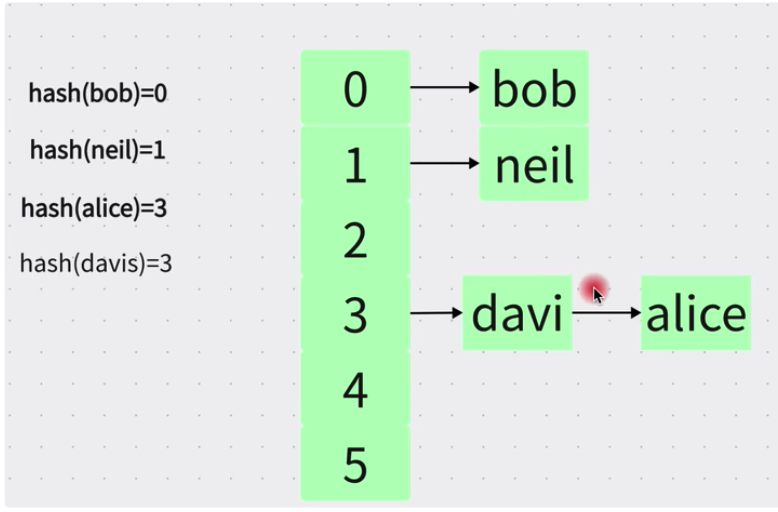

### 1.二叉树

> 搜索复杂度在 O(log2n)到O(n)之间

- 每个节点最多两个子节点
- 左侧节点小于当前节点右侧节点大于当前节点

正常情况下

极端情况下

### 2.平衡二叉树

- 每个节点最多两个子节点
- 左侧节点小于当前节点右侧节点大于当前节点
- 任何节点的两个子节点的高度差最大为1
- 如果对平衡二叉树的节点进行新增或者删除，就可能破坏平衡，就会触发旋转操作，最终平衡

### 3.红黑树

- 每个节点不是红色就是黑色
- 叶子节点为黑色的(NULL)
- 任何相邻的两个节点不能同时为红色
- 任意从根节点到叶子节点的路径中黑色节点数量相同

### 4.Hash算法

- 对索引的key进行hash计算就可以定位数据存储的位置
- 很多时候hash比B+索引更高效
- 只支持 = IN 不支持范围查询
- hash冲突问题

### 5.b树

- 叶子节点具有相同的深度，叶子节点的指针为空
- 所有索引数据不重复
- 节点中的数据索引从左到右递增排列
- 数据节点存在每个节点上

### 6.b+ 树

- 非叶子节点不存储data，只存储索引(冗余)，可以放更多索引
- 叶子节点包含所有索引字段
- 叶子节点之间用双向指针链接，提高范围查找的性能

