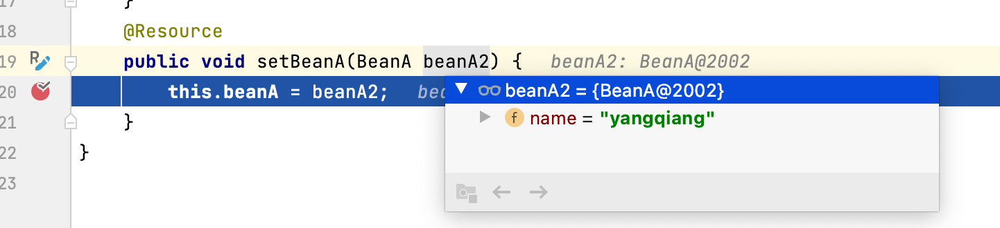
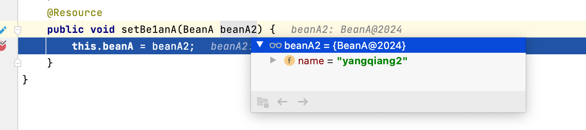
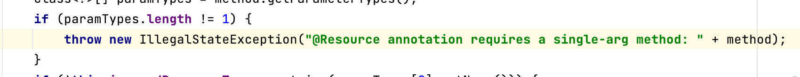

1. @Resource 在spring中作用的范围是 字段或者 方法中(其他方法无效) 

​       @Autowired在spring中作用的范围是 字段 set方法，枚举类型，构造方法，参数五个位置进行注入

2.@Resource 默认是byName没有则byType  如果设置了name属性那就是byName 没有就报错

  @Autowired 默认是byType 如果找到多个以后就byName 如果name不满足就报错，也可以搭配

  @Qualifier 进行byName的注入

3.@Resource 和 @Autowired 同时作用于方法中时 

- @Resource 会用方法名称去取bean对象 是set方法的话会去截取,如果方法名称取不到bean 会选择参数名进行注入。

- @Resource 作用的方法只能有一个参数,@Autowired支持多个

