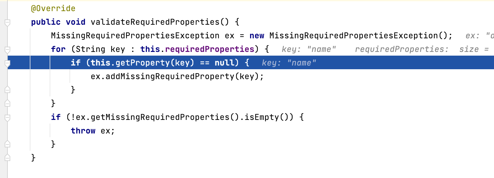

### 1.首先通过javaconfig的方式来配置一下spring容器

> 这里通过继承`AnnotationConfigApplicationContext`的方式来对其进行扩展

```java
package com.example.yq.ioc.initproperty;

import org.springframework.context.annotation.ComponentScan;
import org.springframework.context.annotation.Configuration;

@Configuration
@ComponentScan
public class AnnotationConfig {

}
```

```java
package com.example.yq.ioc.initproperty;

import org.springframework.stereotype.Component;

@Component
public class BeanA {
    private Long id;
    private String name;

    public Long getId() {
        return id;
    }

    public void setId(Long id) {
        this.id = id;
    }

    public String getName() {
        return name;
    }

    public void setName(String name) {
        this.name = name;
    }
}
```

```java
package com.example.yq.ioc.initproperty;

import org.springframework.context.annotation.AnnotationConfigApplicationContext;

public class MyAnnotationConfigApplicationContext extends AnnotationConfigApplicationContext {
    public MyAnnotationConfigApplicationContext(Class<?>... componentClasses) {
        super(componentClasses);
    }
}
```

```java
package com.example.yq.ioc.initproperty;


public class IOCTest {
    public static void main(String[] args) {
        MyAnnotationConfigApplicationContext context = new MyAnnotationConfigApplicationContext(AnnotationConfig.class);
        BeanA beanA = context.getBean(BeanA.class);
        System.out.println(beanA);
    }
}
```


### 2.从`refresh()` 开始调试

```java
public void refresh() throws BeansException, IllegalStateException {
   synchronized (this.startupShutdownMonitor) {
      StartupStep contextRefresh = this.applicationStartup.start("spring.context.refresh");

      // 准备进行上下文刷新
      /**
       * 1.设置容器的启动时间
       * 2.设置活跃状态为true
       * 3.设置关闭状态为false
       * 4.获取Environment对象。并加载系统属性到Environment对象中
       * 5.准备监听器和事件的集合对象。默认为空可扩展
       */

      prepareRefresh();

      // 这一步比较关键，这一步完成后，配置文件就会解析成一个个 Bean 定义，注册到 BeanFactory 中，
      // 当然，这里说的 Bean 还没有初始化，只是配置信息都提取出来了，
      // 注册也只是将这些信息都保存到了注册中心(说到底核心是一个 beanName-> beanDefinition 的 map)

      /**
       * 1.关闭旧的 BeanFactory (如果有)
       * 2.创建新的 BeanFactory
       * 3.设置 BeanFactory 的两个配置属性：是否允许 Bean 覆盖、是否允许循环引用
       * 4.加载 BeanDefinition、注册 BeanDefinition 等等
       * 5.取到已经创建好并且初始化的beanFactory
       * */
      ConfigurableListableBeanFactory beanFactory = obtainFreshBeanFactory();


      // 设置 BeanFactory 的类加载器，添加几个 BeanPostProcessor，手动注册几个特殊的 bean
      /**
       * 1.注册SPEL表达式的解析策略。
       * 2.注册属性编辑器ResourceEditorRegistrar
       * 3.添加BeanPostProcessor ApplicationContextAwareProcessor 实现Aware接口的时候注入对应的bean
       *   1.EnvironmentAware
       *   2.EmbeddedValueResolverAware
       *   3.ResourceLoaderAware
       *   4.ApplicationEventPublisherAware
       *   5.MessageSourceAware
       *   6.ApplicationContextAware
       *   7.ApplicationStartupAware
       * 4.添加自动装配依赖忽略的接口7种Aware接口
       * 5.预置内部依赖BeanFactory ResourceLoader ApplicationEventPublisher ApplicationContext
       * 6.添加BeanPostProcessor ApplicationListenerDetector
       * 7.判读是否加入BeanPostProcessor LoadTimeWeaverAwareProcessor
       * 8.注册默认的几个环境变量bean  environment systemProperties systemEnvironment applicationStartup
       * */
      prepareBeanFactory(beanFactory);

      try {
         // Allows post-processing of the bean factory in context subclasses.
         // 这里需要知道 BeanFactoryPostProcessor 这个知识点，Bean 如果实现了此接口，
         // 那么在容器初始化以后，Spring 会负责调用里面的 postProcessBeanFactory 方法。】

         // 这里是提供给子类的扩展点，到这里的时候，所有的 Bean 都加载、注册完成了，但是都还没有初始化
         // 具体的子类可以在这步的时候添加一些特殊的 BeanFactoryPostProcessor 的实现类或做点什么事
         postProcessBeanFactory(beanFactory);

         StartupStep beanPostProcess = this.applicationStartup.start("spring.context.beans.post-process");
         // Invoke factory processors registered as beans in the context.
         // 调用BeanDefinitionRegistryPostProcessor各个实现类的postProcessBeanDefinitionRegistry方法
         // 调用 BeanFactoryPostProcessor 各个实现类的 postProcessBeanFactory(factory) 回调方法
         /**
          * 1.调用BeanDefinitionRegistryPostProcessor的postProcessBeanDefinitionRegistry方法
          *    顺序 实现了PriorityOrdered getOrder方法 从小到大排序
          *        实现了Ordered         getOrder方法 从小到大排序
          *        剩下的实现BeanDefinitionRegistryPostProcessor方法的按bean注册顺序排序
          *
          * 2.调用BeanDefinitionRegistryPostProcessor的postProcessBeanFactory方法 按照上面排好的顺序执行
          *
          * 3.调用实现BeanFactoryPostProcessor的bean的postProcessBeanFactory方法 (已经执行过的会去除)
          *    顺序 实现了PriorityOrdered getOrder方法 从小到大排序
          *          实现了Ordered         getOrder方法 从小到大排序
          *          剩下的实现BeanFactoryPostProcessor方法的按bean注册顺序排序
          *
          * 4.添加LoadTimeWeaverAwareProcessor
          * */
         invokeBeanFactoryPostProcessors(beanFactory);

         // 注册 BeanPostProcessor 的实现类，注意看和 BeanFactoryPostProcessor 的区别
         // 此接口两个方法: postProcessBeforeInitialization 和 postProcessAfterInitialization
         // 两个方法分别在 Bean 初始化之前和初始化之后得到执行。这里仅仅是注册，之后会看到回调这两方法的时机
         /**
          * 注册实现了BeanPostProcessor接口bean 到beanPostProcessors
          * 顺序
          *   spring预置的
          *   实现了priorityOrdered接口的
          *   注册实现Ordered接口的
          *   普通实现了BeanPostProcessor接口的
          *   实现了MergedBeanDefinitionPostProcessor接口的 Spring内部BeanPostprocessor
          *   ApplicationListenerDetector
          * */
         registerBeanPostProcessors(beanFactory);
               //结束beanPostProcess操作
         beanPostProcess.end();

         // Initialize message source for this context.
         // 初始化 国际化资源
         initMessageSource();

         // Initialize event multicaster for this context.
         // 初始化当前 ApplicationContext 的事件广播器
         initApplicationEventMulticaster();

         // Initialize other special beans in specific context subclasses.
         // 从方法名就可以知道，典型的模板方法(钩子方法)
         // 具体的子类可以在这里初始化一些特殊的 Bean（在初始化 singleton beans 之前） 后续SpringBoot会进扩展
         onRefresh();

         // Check for listener beans and register them.
         // 注册监听器
         registerListeners();

         // Instantiate all remaining (non-lazy-init) singletons.
         // 重点，重点，重点
         // 初始化所有的 singleton beans
         //（lazy-init 的除外）
         /**
          * 1.注册conversionService 类型转换器bean
          * 2.注册一个默认的嵌入值解析器，主要用于解析注解属性值
          * 3.初始化LoadTimeWeaverAware Bean实例对象
          * 4.开始初始化操作单例bean
          * */
         finishBeanFactoryInitialization(beanFactory);

         // Last step: publish corresponding event.
         // 最后一步：发布相应的事件。
         finishRefresh();
      } catch (BeansException ex) {
         if (logger.isWarnEnabled()) {
            logger.warn("Exception encountered during context initialization - " +
                  "cancelling refresh attempt: " + ex);
         }

         // Destroy already created singletons to avoid dangling resources.
         destroyBeans();

         // Reset 'active' flag.
         cancelRefresh(ex);

         // Propagate exception to caller.
         throw ex;
      } finally {
         // Reset common introspection caches in Spring's core, since we
         // might not ever need metadata for singleton beans anymore...
         resetCommonCaches();
         contextRefresh.end();
      }
   }
}
```

#### 1.准备进行上下文刷新--prepareRefresh()

```java
protected void prepareRefresh() {
   // Switch to active.
   // 设置容器启动的时间
   this.startupDate = System.currentTimeMillis();
   // 容器的关闭标志位
   this.closed.set(false);
   // 容器的激活标志位
   this.active.set(true);
   // 记录日志
   if (logger.isDebugEnabled()) {
      if (logger.isTraceEnabled()) {
         logger.trace("Refreshing " + this);
      } else {
         logger.debug("Refreshing " + getDisplayName());
      }
   }

   // Initialize any placeholder property sources in the context environment.
   // 留给子类扩展Application
   initPropertySources();

   // Validate that all properties marked as required are resolvable:
   // see ConfigurablePropertyResolver#setRequiredProperties
   // 校验环境变量中必须有的属性  可以在上面的扩展中加入到里面
   getEnvironment().validateRequiredProperties();

   // Store pre-refresh ApplicationListeners...
   // 存储预刷新应用监听 方便扩展 SpringBoot源码中applicationListeners是有对应的监听器的
   // 早期事件监听器还没有进行初始化的时候 来进行存储早期事件  监听器初始化完成后发送早期事件
   if (this.earlyApplicationListeners == null) {
      this.earlyApplicationListeners = new LinkedHashSet<>(this.applicationListeners);
   } else {
      // Reset local application listeners to pre-refresh state.
      this.applicationListeners.clear();
      this.applicationListeners.addAll(this.earlyApplicationListeners);
   }

   // Allow for the collection of early ApplicationEvents,
   // to be published once the multicaster is available...
   //  收集早期事件 multicaster 初始化完成后会统一去发布事件
   this.earlyApplicationEvents = new LinkedHashSet<>();
}
```


##### 1.设置容器的启动时间

##### 2.设置容器的关闭标志位为false

##### 3.设置容器的激活标志位为true

##### 4.执行扩展方法`initPropertySources` ,这里我们用`MyAnnotationConfigApplicationContext`进行扩展

```java
package com.example.yq.ioc.initproperty;

import org.springframework.context.annotation.AnnotationConfigApplicationContext;
import org.springframework.core.env.ConfigurableEnvironment;
import org.springframework.core.env.MutablePropertySources;
import org.springframework.core.env.PropertiesPropertySource;

import java.util.Map;
import java.util.Properties;

public class MyAnnotationConfigApplicationContext extends AnnotationConfigApplicationContext {
    public MyAnnotationConfigApplicationContext(Class<?>... componentClasses) {
        super(componentClasses);
    }

   @Override
   protected void initPropertySources() {
      System.out.println("initPropertySources扩展  -------可以对系统环境变量进行修改,以及加入校验");
      ConfigurableEnvironment environment = getEnvironment();
      MutablePropertySources propertySources = environment.getPropertySources();
      // 获得系统属性
      Map<String, Object> systemProperties = environment.getSystemProperties();
      // 获取系统环境变量
      Map<String, Object> systemEnvironment = environment.getSystemEnvironment();

        // 新增一套环境变量
      Properties properties = new Properties();
      properties.put("name","smallwhite");
      PropertiesPropertySource propertySource = new PropertiesPropertySource("smalwhite",properties);
      propertySources.addLast(propertySource);

        //设置 要校验的属性 必须存在 name这个key
      environment.setRequiredProperties("name");

   }
}
```


##### 5.`validateRequiredProperties()` 属性校验

> 我们对`initPropertySources` 方法进行扩展后`validateRequiredProperties`方法就会对设置了必须有的属性进行校验




##### 6.注册初始监听器bean对象

##### 7.创建收集早期事件的`earlyApplicationEvents`

>早期事件多播器(事件广播器)还没有初始化完成的时候可能会存在发送事件的操作。这种事件就叫做早期事件
>
>此时没有事件广播器去发送事件。只能将早期事件存储到`earlyApplicationEvents`中。
>
>等待事件广播器初始化后发送早期事件，再将`earlyApplicationEvents`设置为null。表明早期事件已经发送完成。而后产生的 发送事件操作都将不视为早期事件。由事件广播器即时发送

```java
protected void publishEvent(Object event, @Nullable ResolvableType eventType) {
   Assert.notNull(event, "Event must not be null");

   // Decorate event as an ApplicationEvent if necessary
   // 1.如有必要，将事件装饰为ApplicationEvent
   ApplicationEvent applicationEvent;
   if (event instanceof ApplicationEvent) {
      applicationEvent = (ApplicationEvent) event;
   } else {
      applicationEvent = new PayloadApplicationEvent<>(this, event, eventType);
      if (eventType == null) {
         eventType = ((PayloadApplicationEvent<?>) applicationEvent).getResolvableType();
      }
   }

   // Multicast right now if possible - or lazily once the multicaster is initialized
   // 事件广播器没有初始化完成的话作为早期事件进行存储
   if (this.earlyApplicationEvents != null) {
      this.earlyApplicationEvents.add(applicationEvent);
   } else {
      // 2.使用事件广播器广播事件到相应的监听器
      getApplicationEventMulticaster().multicastEvent(applicationEvent, eventType);
   }

   // Publish event via parent context as well...
   // 3.同样的，通过parent发布事件......
   if (this.parent != null) {
      if (this.parent instanceof AbstractApplicationContext) {
         ((AbstractApplicationContext) this.parent).publishEvent(event, eventType);
      } else {
         this.parent.publishEvent(event);
      }
   }
}
```

**早期事件示例**

> 实现BeanFactoryPostProcessor的bean 的回调是在第5步`invokeBeanFactoryPostProcessors`中进行的 而事件发布器是在第8步`initApplicationEventMulticaster`进行的。所以如果我们在`postProcessBeanFactory`回调中去发布事件的话。就会保存到早期事件中 此时的消息也不会进行发布 后续由发布器统一发布。

```java
package com.example.yq.ioc.initproperty;

import org.springframework.beans.BeansException;
import org.springframework.beans.factory.config.BeanFactoryPostProcessor;
import org.springframework.beans.factory.config.ConfigurableListableBeanFactory;
import org.springframework.context.ApplicationContext;
import org.springframework.context.ApplicationContextAware;
import org.springframework.context.ApplicationEventPublisher;
import org.springframework.stereotype.Component;

@Component
public class MyEarlyApplicationEvents implements BeanFactoryPostProcessor, ApplicationContextAware {

   ApplicationEventPublisher applicationEventPublisher;
   
   @Override
   public void setApplicationContext(ApplicationContext applicationContext) throws BeansException {
       this.applicationEventPublisher = (ApplicationEventPublisher)applicationContext;
   }
   
   @Override
   public void postProcessBeanFactory(ConfigurableListableBeanFactory beanFactory) throws BeansException {
      applicationEventPublisher.publishEvent("1");
   }
}
```

#### 2.获得BeanFactory --obtainFreshBeanFactory()

> 这一步比较关键，这一步完成后，基于xml配置的配置文件就会解析成一个个 `BeanDefinition`，注册到 `BeanFactory`的`beanDefinitionMap` 中 当然，这里说的 Bean 还没有初始化，只是配置信息都提取出来了，注册也只是将这些信息都保存到了注册中心(说到底核心是一个 beanName-> beanDefinition 的 map)
>
> 基础javaconfig的配置会生成默认的BeanFactory

#### 3.BeanFactory的准备阶段--prepareBeanFactory()

> ```
> 1.注册SPEL表达式的解析策略。
> 2.注册属性编辑器ResourceEditorRegistrar
> 3.添加BeanPostProcessor ApplicationContextAwareProcessor 实现Aware接口的时候注入对应的bean
>   1.EnvironmentAware
>   2.EmbeddedValueResolverAware
>   3.ResourceLoaderAware
>   4.ApplicationEventPublisherAware
>   5.MessageSourceAware
>   6.ApplicationContextAware
>   7.ApplicationStartupAware
> 4.添加自动装配依赖忽略的接口7种Aware接口
> 5.预置内部依赖BeanFactory ResourceLoader ApplicationEventPublisher ApplicationContext
> 6.添加BeanPostProcessor ApplicationListenerDetector
> 7.判读是否加入BeanPostProcessor LoadTimeWeaverAwareProcessor
> 8.注册默认的几个环境变量bean  environment systemProperties systemEnvironment applicationStartup
> ```

#### 4.BeanFactory的扩展阶段--postProcessBeanFactory()

> 这个方法没有具体的实现方法
>
> 这里是提供给子类的扩展点，到这里的时候，所有的 BeanDefinition 都加载、注册完成了，但是都还没有初始化
> 具体的子类可以在这步的时候添加一些特殊的 BeanFactoryPostProcessor 的实现类或做点什么事


#### 5.BeanFactoryPostProcessor的回调阶段--invokeBeanFactoryPostProcessors()

>1.调用实现了 `BeanDefinitionRegistryPostProcessor`的 `postProcessBeanDefinitionRegistry(BeanDefinitionRegistry registry)`方法这里可以对容器中的所有beanDefinition进行新增修改删除操作
>
>2.调用实现了`BeanFactoryPostProcessor`的`postProcessBeanFactory(ConfigurableListableBeanFactory beanFactory)`方法可以对`BeanDefinition`进行一些修改

#### 6.注册BeanPostProcessor-- registerBeanPostProcessors()

> 顺序 
>
> 1.实现了priorityOrdered接口的
>
> 2.注册实现Ordered接口的
>
> 3.普通实现了BeanPostProcessor接口的
>
> 4.实现了MergedBeanDefinitionPostProcessor接口的 Spring内部BeanPostprocessor

```java
public static void registerBeanPostProcessors(
      ConfigurableListableBeanFactory beanFactory, AbstractApplicationContext applicationContext) {
   
   String[] postProcessorNames = beanFactory.getBeanNamesForType(BeanPostProcessor.class, true, false);

   // Register BeanPostProcessorChecker that logs an info message when
   // a bean is created during BeanPostProcessor instantiation, i.e. when
   // a bean is not eligible for getting processed by all BeanPostProcessors.
   // BeanPostProcessor的目标计数
   int beanProcessorTargetCount = beanFactory.getBeanPostProcessorCount() + 1 + postProcessorNames.length;
   // 2.添加BeanPostProcessorChecker(主要用于记录信息)到beanFactory中
   beanFactory.addBeanPostProcessor(new BeanPostProcessorChecker(beanFactory, beanProcessorTargetCount));

   // Separate between BeanPostProcessors that implement PriorityOrdered,
   // Ordered, and the rest.
   // 3.定义不同的变量用于区分: 实现PriorityOrdered接口的BeanPostProcessor、实现Ordered接口的BeanPostProcessor、普通BeanPostProcessor
   // 3.1 priorityOrderedPostProcessors: 用于存放实现PriorityOrdered接口的BeanPostProcessor
   List<BeanPostProcessor> priorityOrderedPostProcessors = new ArrayList<>();
   // 3.2 internalPostProcessors: 用于存放Spring内部的BeanPostProcessor
   List<BeanPostProcessor> internalPostProcessors = new ArrayList<>();
   // 3.3 orderedPostProcessorNames: 用于存放实现Ordered接口的BeanPostProcessor的beanName
   List<String> orderedPostProcessorNames = new ArrayList<>();
   // 3.4 nonOrderedPostProcessorNames: 用于存放普通BeanPostProcessor的beanName
   List<String> nonOrderedPostProcessorNames = new ArrayList<>();
   // 4.遍历postProcessorNames, 将BeanPostProcessors按3.1 - 3.4定义的变量区分开
   for (String ppName : postProcessorNames) {
      // 4.1 如果ppName对应的Bean实例实现了PriorityOrdered接口, 则拿到ppName对应的Bean实例并添加到priorityOrderedPostProcessors
      if (beanFactory.isTypeMatch(ppName, PriorityOrdered.class)) {
         BeanPostProcessor pp = beanFactory.getBean(ppName, BeanPostProcessor.class);
         priorityOrderedPostProcessors.add(pp);
         if (pp instanceof MergedBeanDefinitionPostProcessor) {
            // 4.2 如果ppName对应的Bean实例也实现了MergedBeanDefinitionPostProcessor接口,
            // 则将ppName对应的Bean实例添加到internalPostProcessors
            internalPostProcessors.add(pp);
         }
      }
      else if (beanFactory.isTypeMatch(ppName, Ordered.class)) {
         // 4.3 如果ppName对应的Bean实例没有实现PriorityOrdered接口, 但是实现了Ordered接口, 则将ppName添加到orderedPostProcessorNames
         orderedPostProcessorNames.add(ppName);
      }
      else {
         // 4.4 否则, 将ppName添加到nonOrderedPostProcessorNames
         nonOrderedPostProcessorNames.add(ppName);
      }
   }

   // First, register the BeanPostProcessors that implement PriorityOrdered.
   // 5.首先, 注册实现PriorityOrdered接口的BeanPostProcessors
   // 5.1 对priorityOrderedPostProcessors进行排序
   sortPostProcessors(priorityOrderedPostProcessors, beanFactory);
   // 5.2 注册priorityOrderedPostProcessors
   registerBeanPostProcessors(beanFactory, priorityOrderedPostProcessors);

   // Next, register the BeanPostProcessors that implement Ordered.
   // 6.接下来, 注册实现Ordered接口的BeanPostProcessors
   List<BeanPostProcessor> orderedPostProcessors = new ArrayList<>(orderedPostProcessorNames.size());
   for (String ppName : orderedPostProcessorNames) {
      // 6.1 拿到ppName对应的BeanPostProcessor实例对象
      BeanPostProcessor pp = beanFactory.getBean(ppName, BeanPostProcessor.class);
      // 6.2 将ppName对应的BeanPostProcessor实例对象添加到orderedPostProcessors, 准备执行注册
      orderedPostProcessors.add(pp);
      // 6.3 如果ppName对应的Bean实例也实现了MergedBeanDefinitionPostProcessor接口,
      // 则将ppName对应的Bean实例添加到internalPostProcessors
      if (pp instanceof MergedBeanDefinitionPostProcessor) {
         internalPostProcessors.add(pp);
      }
   }
   // 6.4 对orderedPostProcessors进行排序
   sortPostProcessors(orderedPostProcessors, beanFactory);
   // 6.5 注册orderedPostProcessors
   registerBeanPostProcessors(beanFactory, orderedPostProcessors);

   // Now, register all regular BeanPostProcessors.
   // 7.注册所有常规的BeanPostProcessors（过程与6类似）
   List<BeanPostProcessor> nonOrderedPostProcessors = new ArrayList<>(nonOrderedPostProcessorNames.size());
   for (String ppName : nonOrderedPostProcessorNames) {
      BeanPostProcessor pp = beanFactory.getBean(ppName, BeanPostProcessor.class);
      nonOrderedPostProcessors.add(pp);
      if (pp instanceof MergedBeanDefinitionPostProcessor) {
         internalPostProcessors.add(pp);
      }
   }
   registerBeanPostProcessors(beanFactory, nonOrderedPostProcessors);

   // Finally, re-register all internal BeanPostProcessors.
   // 8.最后, 重新注册所有内部BeanPostProcessors（相当于内部的BeanPostProcessor会被移到处理器链的末尾）
   // 8.1 对internalPostProcessors进行排序
   sortPostProcessors(internalPostProcessors, beanFactory);
   // 8.2注册internalPostProcessors
   registerBeanPostProcessors(beanFactory, internalPostProcessors);

   // Re-register post-processor for detecting inner beans as ApplicationListeners,
   // moving it to the end of the processor chain (for picking up proxies etc).
   // 9.重新注册ApplicationListenerDetector（跟8类似，主要是为了移动到处理器链的末尾）
   beanFactory.addBeanPostProcessor(new ApplicationListenerDetector(applicationContext));
}
```

#### 7.初始化国际化资源

> 注册messageSource bean

#### 8.初始化事件广播器--initApplicationEventMulticaster()

> 注册applicationEventMulticaster bean

#### 9.模板方法由子类进行扩展--onRefresh()

> SpringBoot启动tomcat容器就是在这里进行的

#### 10.注册监听器,发布早期事件-- registerListeners()

```java
protected void registerListeners() {
   // Register statically specified listeners first.
   // 添加监听器对象
   for (ApplicationListener<?> listener : getApplicationListeners()) {
      getApplicationEventMulticaster().addApplicationListener(listener);
   }
   // 添加监听器beanName
   // Do not initialize FactoryBeans here: We need to leave all regular beans
   // uninitialized to let post-processors apply to them!
   String[] listenerBeanNames = getBeanNamesForType(ApplicationListener.class, true, false);
   for (String listenerBeanName : listenerBeanNames) {
      getApplicationEventMulticaster().addApplicationListenerBean(listenerBeanName);
   }

   // Publish early application events now that we finally have a multicaster...
   Set<ApplicationEvent> earlyEventsToProcess = this.earlyApplicationEvents;
   this.earlyApplicationEvents = null;
   //注册监听器的时候把早期事件进行发布
   if (!CollectionUtils.isEmpty(earlyEventsToProcess)) {
      for (ApplicationEvent earlyEvent : earlyEventsToProcess) {
         getApplicationEventMulticaster().multicastEvent(earlyEvent);
      }
   }
```


#### 11.初始化所有单例非懒加载的bean--finishBeanFactoryInitialization(beanFactory)


#### 12.发布相应的事件--finishRefresh()

```java
protected void finishRefresh() {
   // Clear context-level resource caches (such as ASM metadata from scanning).
   clearResourceCaches();

   // Initialize lifecycle processor for this context.
   // 1.为此上下文初始化生命周期处理器

   initLifecycleProcessor();

   // Propagate refresh to lifecycle processor first.
   // 2.首先将刷新完毕事件传播到生命周期处理器（触发isAutoStartup方法返回true的SmartLifecycle的start方法）
   getLifecycleProcessor().onRefresh();

   // Publish the final event.
   // 3.推送上下文刷新完毕事件到相应的监听器
   publishEvent(new ContextRefreshedEvent(this));
}
```

