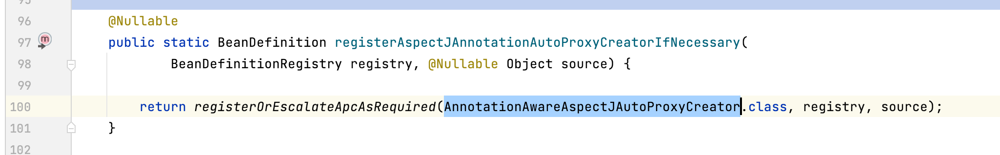
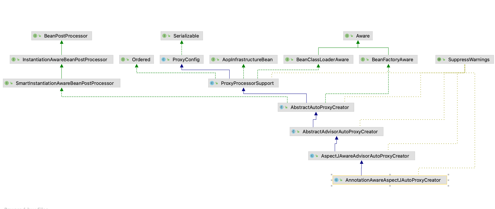
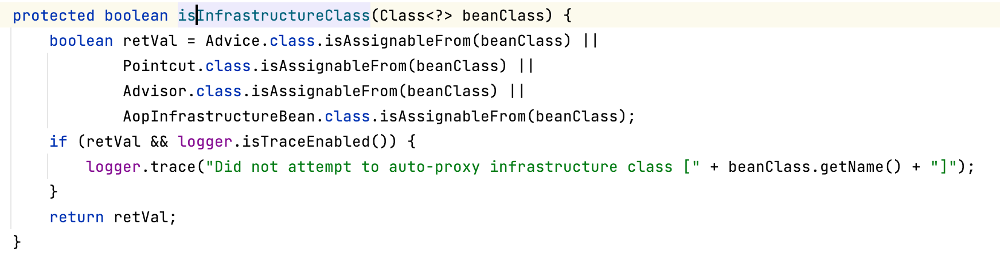
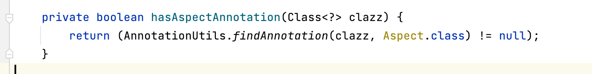

### 1.`@EnableAspectJAutoProxy`

> Spring AOP的开关是靠`@EnableAspectJAutoProxy`开启的。我们可以从这个注解开始去看AOP的整个过程

```java
package org.springframework.context.annotation;

import java.lang.annotation.Documented;
import java.lang.annotation.ElementType;
import java.lang.annotation.Retention;
import java.lang.annotation.RetentionPolicy;
import java.lang.annotation.Target;
@Target(ElementType.TYPE)
@Retention(RetentionPolicy.RUNTIME)
@Documented
@Import(AspectJAutoProxyRegistrar.class)
public @interface EnableAspectJAutoProxy {

	/**
	 * Indicate whether subclass-based (CGLIB) proxies are to be created as opposed
	 * to standard Java interface-based proxies. The default is {@code false}.
	 */
	boolean proxyTargetClass() default false;

	/**
	 * Indicate that the proxy should be exposed by the AOP framework as a {@code ThreadLocal}
	 * for retrieval via the {@link org.springframework.aop.framework.AopContext} class.
	 * Off by default, i.e. no guarantees that {@code AopContext} access will work.
	 * @since 4.3.1
	 */
	boolean exposeProxy() default false;

}

```

#### 属性分析

##### 1.`proxyTargetClass`

> `@EnableAspectJAutoProxy`支持处理标有AspectJ的@Aspect批注的组件,用户可以主动声明`proxyTargetClass`来指定`Spring AOP`使用哪种动态代理方式来创建代理类(默认使用基于实现接口的JDK动态代理方式).设置为true则改为CGLIB类型的代理方式

##### 2.exposeProxy

>为了解决一些由于代理引发的切面失效问题，`Spring AOP`在Spring 4.3.1后引入了`AopContext`类来将代理类的引用存储在ThreadLocal中，通过`AopContext`可以快速获取当前类的代理类.
> 默认为不支持，如果声明为true，即可使用`AopContext`获取代理类.
>
>`AopContext.currentProxy() `获得当前代理对象


##### 3.可以看到 `@EnableAspectJAutoProxy` 注解 里面有一个`@Import`注解 注入了`AspectJAutoProxyRegistrar`这个bean对象。

```java
package org.springframework.context.annotation;

import org.springframework.aop.config.AopConfigUtils;
import org.springframework.beans.factory.support.BeanDefinitionRegistry;
import org.springframework.core.annotation.AnnotationAttributes;
import org.springframework.core.type.AnnotationMetadata;

/**
 * Registers an {@link org.springframework.aop.aspectj.annotation.AnnotationAwareAspectJAutoProxyCreator
 * AnnotationAwareAspectJAutoProxyCreator} against the current {@link BeanDefinitionRegistry}
 * as appropriate based on a given @{@link EnableAspectJAutoProxy} annotation.
 *
 * @author Chris Beams
 * @author Juergen Hoeller
 * @since 3.1
 * @see EnableAspectJAutoProxy
 */
class AspectJAutoProxyRegistrar implements ImportBeanDefinitionRegistrar {

	/**
	 * Register, escalate, and configure the AspectJ auto proxy creator based on the value
	 * of the @{@link EnableAspectJAutoProxy#proxyTargetClass()} attribute on the importing
	 * {@code @Configuration} class.
	 */
	@Override
	public void registerBeanDefinitions(
			AnnotationMetadata importingClassMetadata, BeanDefinitionRegistry registry) {
		// 向容器注册AspectJAnnotationAutoProxyCreator
		AopConfigUtils.registerAspectJAnnotationAutoProxyCreatorIfNecessary(registry);

		//获得@EnableAspectJAutoProxy注解上的两个属性proxyTargetClass exposeProxy 设置到beanDefinition的propertyValues中 
		AnnotationAttributes enableAspectJAutoProxy =
				AnnotationConfigUtils.attributesFor(importingClassMetadata, EnableAspectJAutoProxy.class);
		if (enableAspectJAutoProxy != null) {
			if (enableAspectJAutoProxy.getBoolean("proxyTargetClass")) {
				AopConfigUtils.forceAutoProxyCreatorToUseClassProxying(registry);
			}
			if (enableAspectJAutoProxy.getBoolean("exposeProxy")) {
				AopConfigUtils.forceAutoProxyCreatorToExposeProxy(registry);
			}
		}
	}

}
```




可以看到目前Spring只定义了一个`AnnotationAwareAspectJAutoProxyCreator`类型的bean 然后后续由Spring容器生成

### 2.`AnnotationAwareAspectJAutoProxyCreator`

接下来来看`AnnotationAwareAspectJAutoProxyCreator` 这个bean的实现



可以看到`AnnotationAwareAspectJAutoProxyCreator`是实现了BeanPostProcessor的。后续也会由Spring容器发现并加载到BeanPostProcessor中

#### 1.实例化之前

> `AnnotationAwareAspectJAutoProxyCreator` 是实现了` InstantiationAwareBeanPostProcessor`接口的。所以会在每个bean 实例化之前对其做出校验 是否为AOP基础bean 如果是的话加入到advisedBeans 中

**判断方式**





> 是否实现了`Advice` `Pointcut` `Advisor` 或者类上有 `@Aspect` 注解的认为是AOP基础类

**创建代理对象的地方**

> `AbstractAutoProxyCreator#postProcessAfterInitialization` bean的初始化后置处理

