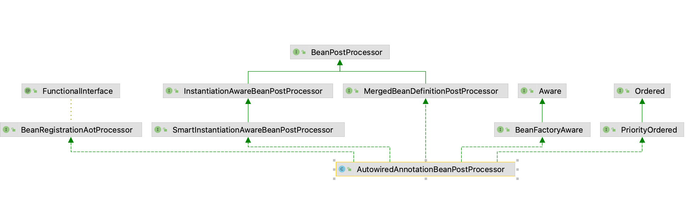

```java
/*
 * Copyright 2002-2019 the original author or authors.
 *
 * Licensed under the Apache License, Version 2.0 (the "License");
 * you may not use this file except in compliance with the License.
 * You may obtain a copy of the License at
 *
 *      https://www.apache.org/licenses/LICENSE-2.0
 *
 * Unless required by applicable law or agreed to in writing, software
 * distributed under the License is distributed on an "AS IS" BASIS,
 * WITHOUT WARRANTIES OR CONDITIONS OF ANY KIND, either express or implied.
 * See the License for the specific language governing permissions and
 * limitations under the License.
 */

package org.springframework.beans.factory.annotation;

import java.lang.annotation.Documented;
import java.lang.annotation.ElementType;
import java.lang.annotation.Retention;
import java.lang.annotation.RetentionPolicy;
import java.lang.annotation.Target;

/**
 * Marks a constructor, field, setter method, or config method as to be autowired by
 * Spring's dependency injection facilities. This is an alternative to the JSR-330
 * {@link jakarta.inject.Inject} annotation, adding required-vs-optional semantics.
 *
 * <h3>Autowired Constructors</h3>
 * <p>Only one constructor of any given bean class may declare this annotation with the
 * {@link #required} attribute set to {@code true}, indicating <i>the</i> constructor
 * to autowire when used as a Spring bean. Furthermore, if the {@code required}
 * attribute is set to {@code true}, only a single constructor may be annotated
 * with {@code @Autowired}. If multiple <i>non-required</i> constructors declare the
 * annotation, they will be considered as candidates for autowiring. The constructor
 * with the greatest number of dependencies that can be satisfied by matching beans
 * in the Spring container will be chosen. If none of the candidates can be satisfied,
 * then a primary/default constructor (if present) will be used. Similarly, if a
 * class declares multiple constructors but none of them is annotated with
 * {@code @Autowired}, then a primary/default constructor (if present) will be used.
 * If a class only declares a single constructor to begin with, it will always be used,
 * even if not annotated. An annotated constructor does not have to be public.
 *
 * <h3>Autowired Fields</h3>
 * <p>Fields are injected right after construction of a bean, before any config methods
 * are invoked. Such a config field does not have to be public.
 *
 * <h3>Autowired Methods</h3>
 * <p>Config methods may have an arbitrary name and any number of arguments; each of
 * those arguments will be autowired with a matching bean in the Spring container.
 * Bean property setter methods are effectively just a special case of such a general
 * config method. Such config methods do not have to be public.
 *
 * <h3>Autowired Parameters</h3>
 * <p>Although {@code @Autowired} can technically be declared on individual method
 * or constructor parameters since Spring Framework 5.0, most parts of the
 * framework ignore such declarations. The only part of the core Spring Framework
 * that actively supports autowired parameters is the JUnit Jupiter support in
 * the {@code spring-test} module (see the
 * <a href="https://docs.spring.io/spring/docs/current/spring-framework-reference/testing.html#testcontext-junit-jupiter-di">TestContext framework</a>
 * reference documentation for details).
 *
 * <h3>Multiple Arguments and 'required' Semantics</h3>
 * <p>In the case of a multi-arg constructor or method, the {@link #required} attribute
 * is applicable to all arguments. Individual parameters may be declared as Java-8 style
 * {@link java.util.Optional} or, as of Spring Framework 5.0, also as {@code @Nullable}
 * or a not-null parameter type in Kotlin, overriding the base 'required' semantics.
 *
 * <h3>Autowiring Arrays, Collections, and Maps</h3>
 * <p>In case of an array, {@link java.util.Collection}, or {@link java.util.Map}
 * dependency type, the container autowires all beans matching the declared value
 * type. For such purposes, the map keys must be declared as type {@code String}
 * which will be resolved to the corresponding bean names. Such a container-provided
 * collection will be ordered, taking into account
 * {@link org.springframework.core.Ordered Ordered} and
 * {@link org.springframework.core.annotation.Order @Order} values of the target
 * components, otherwise following their registration order in the container.
 * Alternatively, a single matching target bean may also be a generally typed
 * {@code Collection} or {@code Map} itself, getting injected as such.
 *
 * <h3>Not supported in {@code BeanPostProcessor} or {@code BeanFactoryPostProcessor}</h3>
 * <p>Note that actual injection is performed through a
 * {@link org.springframework.beans.factory.config.BeanPostProcessor
 * BeanPostProcessor} which in turn means that you <em>cannot</em>
 * use {@code @Autowired} to inject references into
 * {@link org.springframework.beans.factory.config.BeanPostProcessor
 * BeanPostProcessor} or
 * {@link org.springframework.beans.factory.config.BeanFactoryPostProcessor BeanFactoryPostProcessor}
 * types. Please consult the javadoc for the {@link AutowiredAnnotationBeanPostProcessor}
 * class (which, by default, checks for the presence of this annotation).
 *
 * @author Juergen Hoeller
 * @author Mark Fisher
 * @author Sam Brannen
 * @since 2.5
 * @see AutowiredAnnotationBeanPostProcessor
 * @see Qualifier
 * @see Value
 */
@Target({ElementType.CONSTRUCTOR, ElementType.METHOD, ElementType.PARAMETER, ElementType.FIELD, ElementType.ANNOTATION_TYPE})
@Retention(RetentionPolicy.RUNTIME)
@Documented
public @interface Autowired {

	/**
	 * Declares whether the annotated dependency is required.
	 * <p>Defaults to {@code true}.
	 */
	boolean required() default true;

}

```


### 注解作用范围

#### 1.构造器

```java
package org.geekbang.thinking.in.spring.bean.test1.autowired;

import org.springframework.beans.factory.annotation.Autowired;
import org.springframework.stereotype.Component;
@Component
public class ConstructorAutowireBean {
    private BeanB beanB;

    @Autowired
    public ConstructorAutowireBean(BeanB beanB) {
        this.beanB = beanB;
    }
}
```

#### 2.方法

```java
package org.geekbang.thinking.in.spring.bean.test1.autowired;

import org.springframework.beans.factory.annotation.Autowired;
import org.springframework.stereotype.Component;

@Component
public class SetFieldAutowireBean {
    private BeanB beanB;

    @Autowired
    public void setBeanB(BeanB beanB) {
        this.beanB = beanB;
    }
}
```

#### 3.参数

```java
package org.geekbang.thinking.in.spring.bean.test1.autowired;

import org.springframework.beans.factory.annotation.Autowired;
import org.springframework.stereotype.Component;

@Component
public class ParamAutowireBean {
    private BeanB beanB;

    public  ParamAutowireBean(@Autowired BeanB beanB) {
        this.beanB = beanB;
    }

    public BeanB getBeanB() {
        return beanB;
    }
}
```

#### 4.字段

```java
package org.geekbang.thinking.in.spring.bean.test1.autowired;

import org.springframework.beans.factory.annotation.Autowired;
import org.springframework.stereotype.Component;

@Component
public class FieldAutowireBean {
    @Autowired
    private BeanB beanB;


}
```

#### 5.注解

```java
package org.geekbang.thinking.in.spring.bean.test1.autowired;

import org.springframework.beans.factory.annotation.Autowired;

import java.lang.annotation.*;

@Retention(RetentionPolicy.RUNTIME)
@Documented
@Autowired
public @interface MyAutowired {
}
```

```java
package org.geekbang.thinking.in.spring.bean.test1.autowired;

import org.springframework.beans.factory.annotation.Autowired;
import org.springframework.stereotype.Component;

@Component
public class MyAutowiredBean {
    @MyAutowired
    private BeanB beanB;

    public BeanB getBeanB() {
        return beanB;
    }
}
```

#### 测试结果

```java
package org.geekbang.thinking.in.spring.bean.test1.autowired;

import org.springframework.context.annotation.AnnotationConfigApplicationContext;

/**
 *
 * @create 2022-05-24 20:16
 */
public class AutowiredTest {

   public static void main(String[] args) {
      AnnotationConfigApplicationContext context =
            new AnnotationConfigApplicationContext(AnnotationConfig.class);
      context.register(AutowiredTest.class);
      ConstructorAutowireBean constructorAutowireBean = context.getBean(ConstructorAutowireBean.class);
      System.out.println(constructorAutowireBean.getBeanB());

      SetFieldAutowireBean setFieldAutowireBean = context.getBean(SetFieldAutowireBean.class);
      System.out.println(setFieldAutowireBean.getBeanB());

      ParamAutowireBean paramAutowireBean = context.getBean(ParamAutowireBean.class);
      System.out.println(paramAutowireBean.getBeanB());

      FieldAutowireBean fieldAutowireBean = context.getBean(FieldAutowireBean.class);
      System.out.println(fieldAutowireBean.getBeanB());

      MyAutowiredBean myAutowiredBean = context.getBean(MyAutowiredBean.class);
      System.out.println(myAutowiredBean.getBeanB());
   }


}
```

> 得到同一个注入对象

```
org.geekbang.thinking.in.spring.bean.test1.autowired.BeanB@3b2da18f
org.geekbang.thinking.in.spring.bean.test1.autowired.BeanB@3b2da18f
org.geekbang.thinking.in.spring.bean.test1.autowired.BeanB@3b2da18f
org.geekbang.thinking.in.spring.bean.test1.autowired.BeanB@3b2da18f
org.geekbang.thinking.in.spring.bean.test1.autowired.BeanB@3b2da18f
```


#### 源码解析

使用Spring 编程时，使用Ioc，我们只需要声明对象，而由Spring 替我门自动注入，而其中起重要作用则为 `AutowiredAnnotationBeanPostProcessor`，它在bean实例化后，进行这重要的初始化操作。

首先来看AutowiredAnnotationBeanPostProcessor的结构




##### 先看父类`SmartInstantiationAwareBeanPostProcessor`

`AutowiredAnnotationBeanPostProcessor`重写了`determineCandidateConstructors`方法来确定bean创建的构造方法


