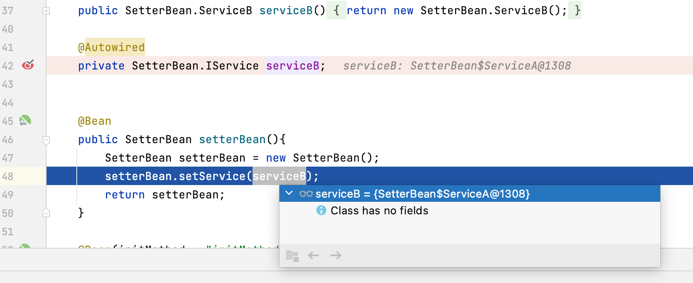

```java
package org.springframework.context.annotation;

import java.lang.annotation.Documented;
import java.lang.annotation.ElementType;
import java.lang.annotation.Retention;
import java.lang.annotation.RetentionPolicy;
import java.lang.annotation.Target;

import org.springframework.beans.factory.support.AbstractBeanDefinition;
import org.springframework.core.annotation.AliasFor;

/**
 *
 * @author Rod Johnson
 * @author Costin Leau
 * @author Chris Beams
 * @author Juergen Hoeller
 * @author Sam Brannen
 * @since 3.0
 * @see Configuration
 * @see Scope
 * @see DependsOn
 * @see Lazy
 * @see Primary
 * @see org.springframework.stereotype.Component
 * @see org.springframework.beans.factory.annotation.Autowired
 * @see org.springframework.beans.factory.annotation.Value
 */
@Target({ElementType.METHOD, ElementType.ANNOTATION_TYPE})
@Retention(RetentionPolicy.RUNTIME)
@Documented
public @interface Bean {

	/**
	 * Alias for {@link #name}.
	 * <p>Intended to be used when no other attributes are needed, for example:
	 * {@code @Bean("customBeanName")}.
	 * @since 4.3.3
	 * @see #name
	 */
	@AliasFor("name")
	String[] value() default {};

	/**
	 * The name of this bean, or if several names, a primary bean name plus aliases.
	 * <p>If left unspecified, the name of the bean is the name of the annotated method.
	 * If specified, the method name is ignored.
	 * <p>The bean name and aliases may also be configured via the {@link #value}
	 * attribute if no other attributes are declared.
	 * @see #value
	 */
	@AliasFor("value")
	String[] name() default {};

	/**
	 * 是否作为候选bean
	 * Is this bean a candidate for getting autowired into some other bean?
	 * <p>Default is {@code true}; set this to {@code false} for internal delegates
	 * that are not meant to get in the way of beans of the same type in other places.
	 * @since 5.1
	 */
	boolean autowireCandidate() default true;

	/**
	 * bean的初始化方法
	 * @see org.springframework.beans.factory.InitializingBean
	 * @see org.springframework.context.ConfigurableApplicationContext#refresh()
	 */
	String initMethod() default "";

	/**
	 * bean的销毁方法
	 * @see org.springframework.beans.factory.DisposableBean
	 * @see org.springframework.context.ConfigurableApplicationContext#close()
	 */
	String destroyMethod() default AbstractBeanDefinition.INFER_METHOD;

}

```


| 属性              | 含义                       |
| ----------------- | -------------------------- |
| value             | bean名称                   |
| name              | bean名称                   |
| autowireCandidate | 是否作为候选bean默认为true |
| initMethod        | 初始化方法                 |
| destroyMethod     | 销毁方法                   |

### 测试autowireCandidate属性

```java
package org.geekbang.thinking.in.spring.bean.test1;


import org.springframework.beans.factory.annotation.Autowired;
import org.springframework.context.annotation.Bean;
/**
 *
 * autowireCandidate = false 属性
 *     此bean不可被其他对象注入！
 *     防止NoUniqueBeanDefinitionException异常
 *     优先级很高阻止其他各种方式想注入这个bean都不行
 *     @Autowired :byName形式的注入 不行
 *     @Primary   :不行 注解失效
 *     @Qualifier :报错没有候选bean
 * @Primary 注解:
 *     优先注入该bean 只能出现一个@Primary 除非其他都被移除出候选项 也就是autowireCandidate = false
 *
 */

public class AnnotationConfig {

   @Bean
   public SetterBean.ServiceA serviceA(){
      return new SetterBean.ServiceA();
   }

   @Bean(autowireCandidate = false)
   public SetterBean.ServiceB serviceB(){
      return new SetterBean.ServiceB();
   }

    @Autowired
   private SetterBean.IService serviceB;


   @Bean
   public SetterBean setterBean(){
      SetterBean setterBean = new SetterBean();
      setterBean.setService(serviceB);
      return setterBean;
   }

   @Bean(initMethod = "initMethod",destroyMethod = "destroyMethod")
   public UserService userService(){
      return new UserService("libai");
   }
}
```

```java
package org.geekbang.thinking.in.spring.bean.test1;


import org.springframework.beans.factory.DisposableBean;
import org.springframework.beans.factory.InitializingBean;

/**
 * @create 2022-05-24 20:17
 */
public class UserService implements InitializingBean, DisposableBean {
    private String name;

    public UserService(String name) {
        System.out.println("userService constructor");
        this.name = name;
    }

    public String getName() {
        return name;
    }

    public void setName(String name) {
        this.name = name;
    }

    public void getUserName() {
        System.out.println(name);
    }

    public void initMethod() {
        System.out.println("userService init");
    }

    public void destroyMethod() {
        System.out.println("userService destroy");
    }

    @Override
    public void afterPropertiesSet() throws Exception {
        System.out.println("UserService afterPropertiesSet");
    }

    @Override
    public void destroy() throws Exception {
        System.out.println("UserService destroy");
    }
}
```



> 说明此时ServiceB已经不会作为bean被注入进来
>
> 但是可以通过依赖获取获得


```java
package org.geekbang.thinking.in.spring.bean.test1;

import org.springframework.context.ApplicationContext;
import org.springframework.context.annotation.AnnotationConfigApplicationContext;

/**
 *
 * @create 2022-05-24 20:16
 */
public class BeanTest {

	public static void main(String[] args) {
		ApplicationContext context =
				new AnnotationConfigApplicationContext(AnnotationConfig.class);
		SetterBean myService = context.getBean(SetterBean.class);
		System.out.println(myService.getService());

		SetterBean.ServiceB bean = context.getBean(SetterBean.ServiceB.class);
		System.out.println(bean);
		UserService userService = context.getBean(UserService.class);

		userService.getUserName();
	}


}
```

测试打印:

```
userService constructor
UserService afterPropertiesSet
userService init
org.geekbang.thinking.in.spring.bean.test1.SetterBean$ServiceA@a1153bc
org.geekbang.thinking.in.spring.bean.test1.SetterBean$ServiceB@1aafa419
libai
```

