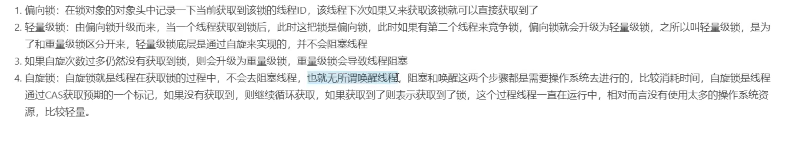

### 1.sychronized 和 ReentrantLock的区别

- sychronized是一个关键字,ReentranLock 是一个类
- sychronized是jvm级别的锁,ReentrantLock是jdk级别的锁
- sychronized锁的是对象的header,ReentrantLock锁的是线程中的state(CAS)
- sychronized是非公平锁,ReentrantLock可以选择公平锁和非公平锁
- sychronized由于jdk自身的优化存在锁升级的过程

### 2.sychronized的自旋锁、偏向锁、轻量级锁、重量级锁

