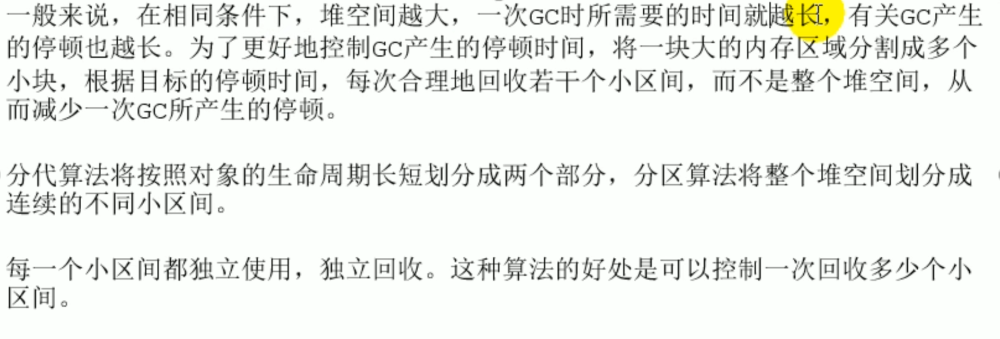
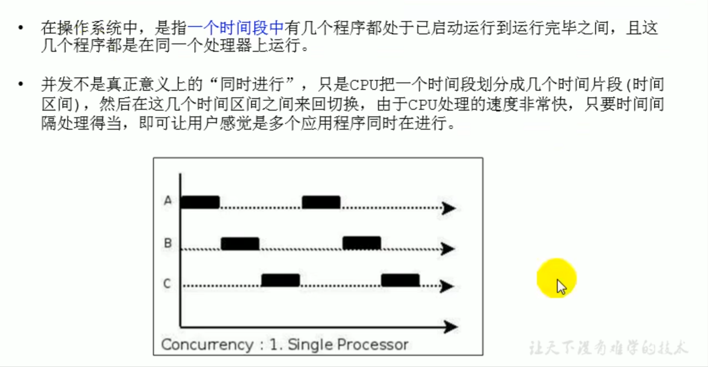
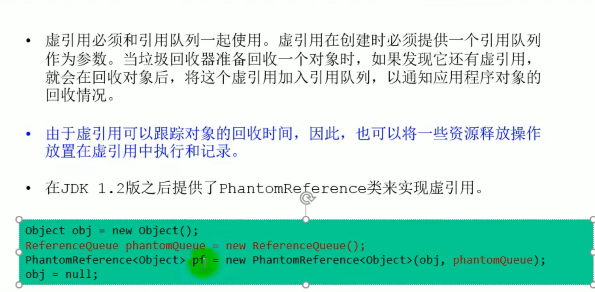

### 垃圾回收阶段涉及到的算法

#### 标记阶段

##### 引用计数算法

##### 可达性分析算法

#### 清除阶段

##### 标记清除算法

##### 复制算法

##### 标记压缩算法

##### 三种算法对比

**分代收集算法**

**增量收集算法**

**分区算法**

#### 对象的finalization机制

### System.gc()

### 内存溢出(OOM)

### 内存泄漏(Memory Leak)

### Stop The World(STW)

### 程序的并行和并发

#### 并发

#### 并行

### 垃圾回收的并行和并发

### 引用

> 强  软 弱 虚 引用强度逐级递减

#### 强引用(Strong Reference) 永不回收

#### 软引用(Soft Reference) 内存不足即回收

#### 弱引用(Weak Reference) 发现即回收

#### 虚引用(Phantom Reference) 对象回收追踪

**终结器引用**

