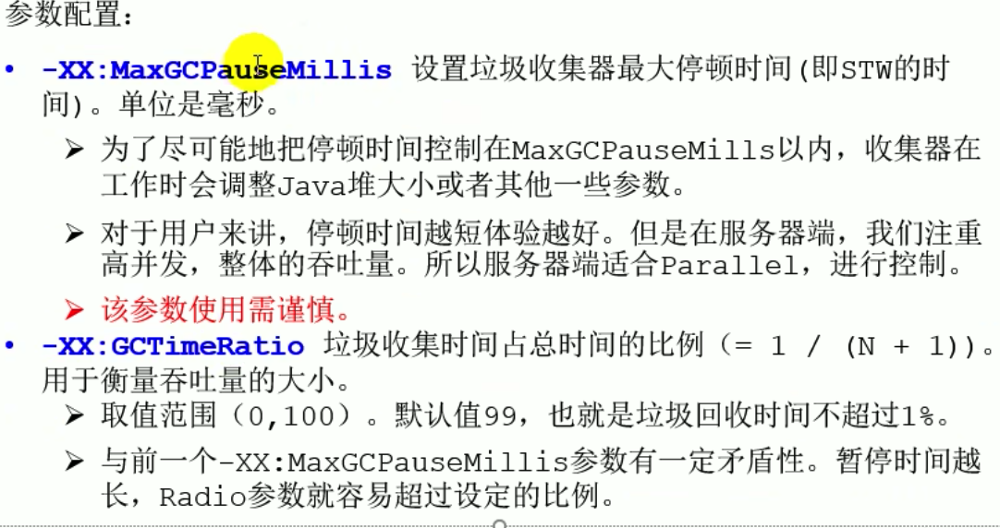

### 垃圾回收器分类

### 评估GC的性能指标

### 常见的垃圾回收器概述

#### 垃圾回收器发展史

**垃圾收集器组合关系**

> 虚线表示jdk8之前 可以进行组合 jdk8之后取消组合关系 jdk9 进行移除组合关系 绿色线表示废弃组合关系

###  Serial回收器 串行回收 

### ParNew回收器 并行回收

### Parallel Scavenge 收集器：吞吐量优先

### Concurrent Mark Sweep(CMS)垃圾收集器 :低延迟

#### 工作原理

#### CMS可以设置的参数

### G1回收器:区域化分代

#### G1可设置的参数

#### G1收集器的适用场景

#### G1回收器的垃圾回收过程

**垃圾回收器总结**

### GC日志分析

