### 1.命令

#### 1.jps(Java Process Status)

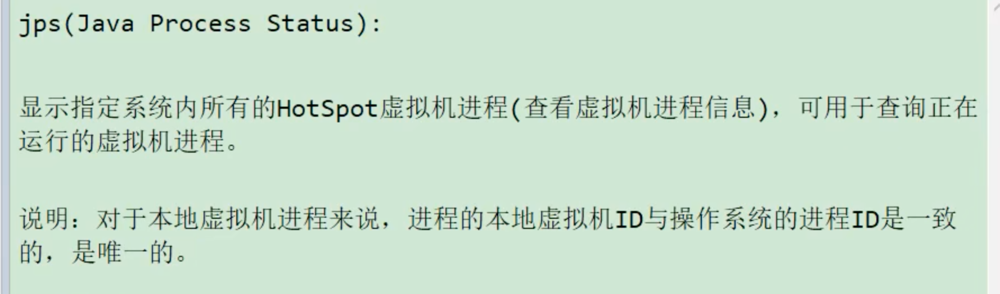

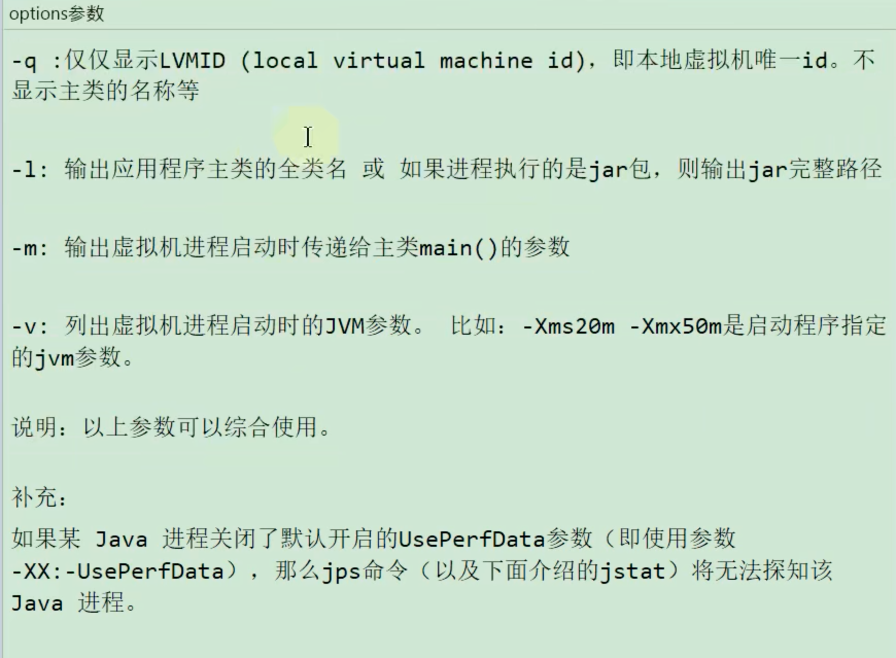

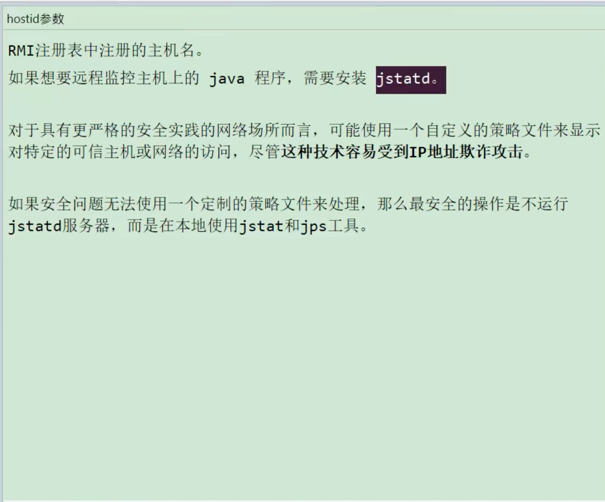

#### 2.jstat(JVM Statistics Monitoring Tool) 

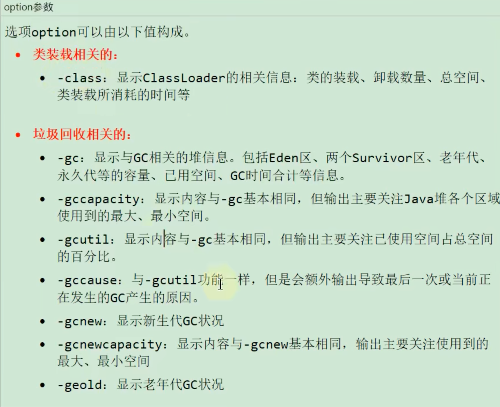

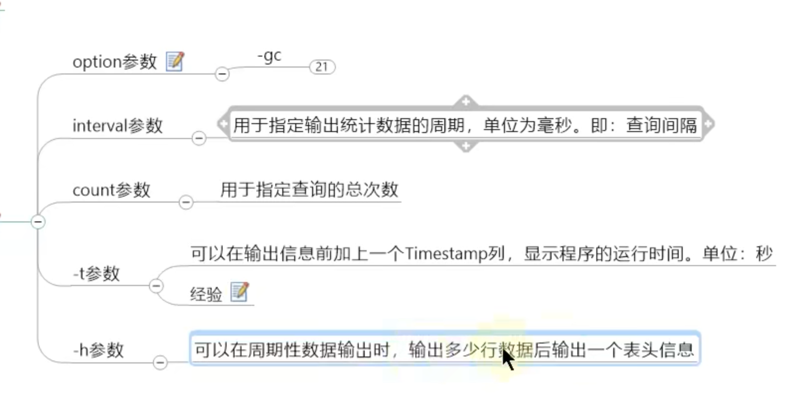

#### 3.jinfo(Configuration Info for Java)

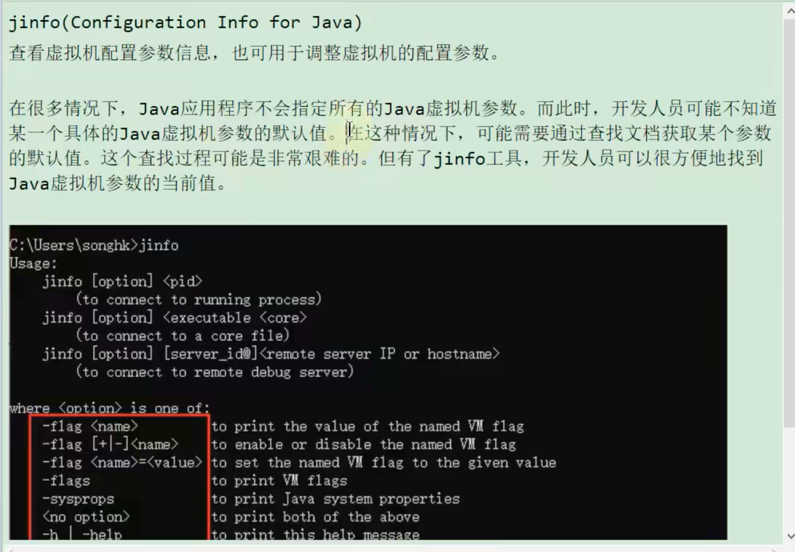

#### 4.jmap(Java Memory Map)

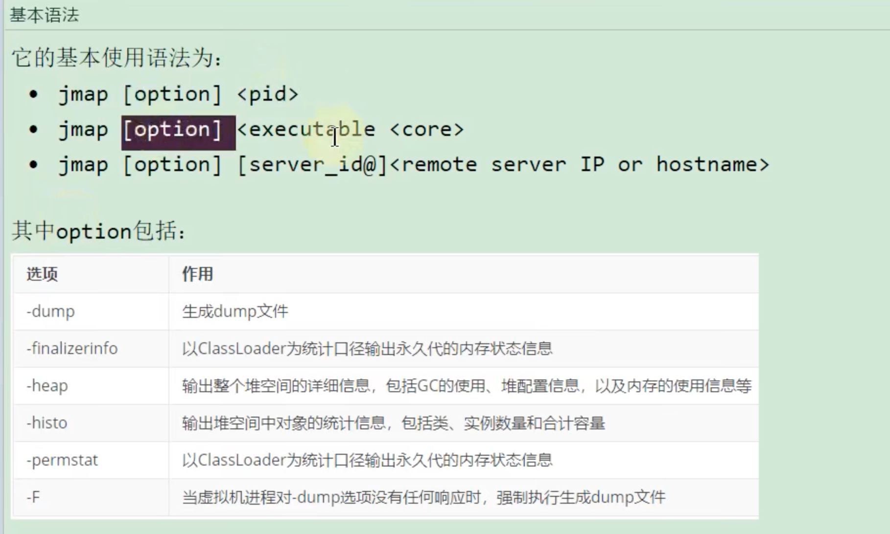

#### 5.jhat(JVM Heap Analysis Tool)

#### 6.jstack(JVM Stack Trace)

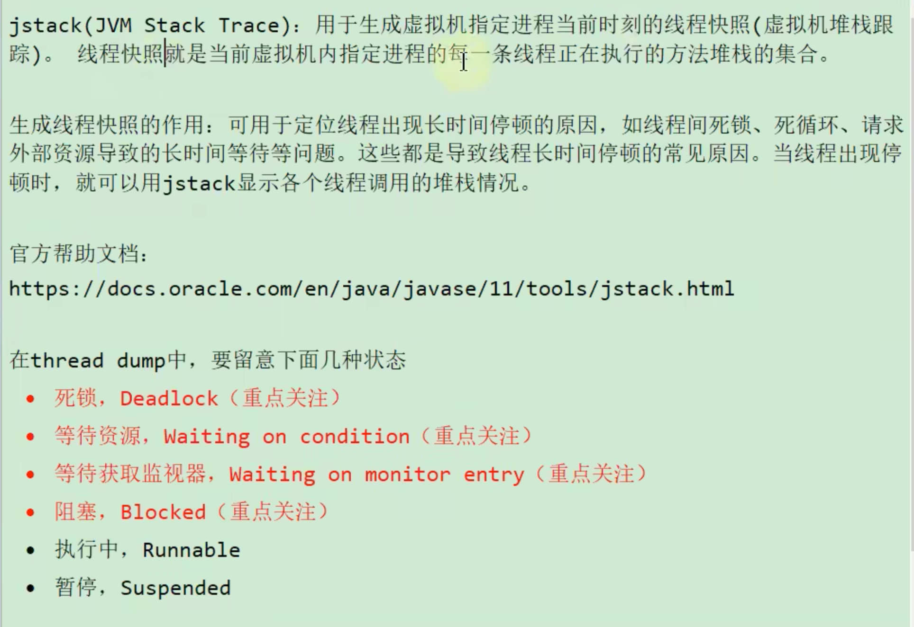

#### 7.jcmd(多功能命令行)

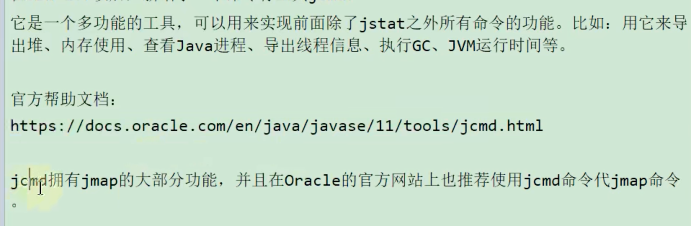

### 2.图形化工具

#### 1.jconsole

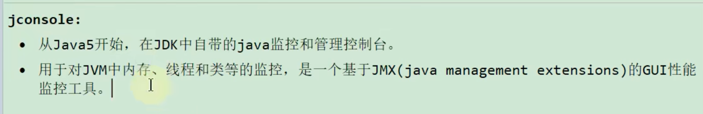

#### 2.Visual VM

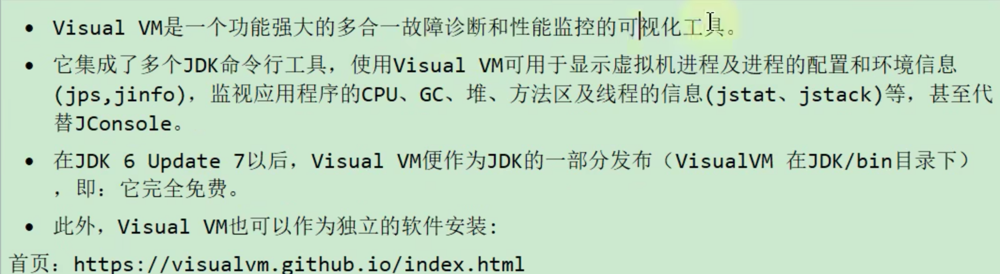

#### 3.JProfiler

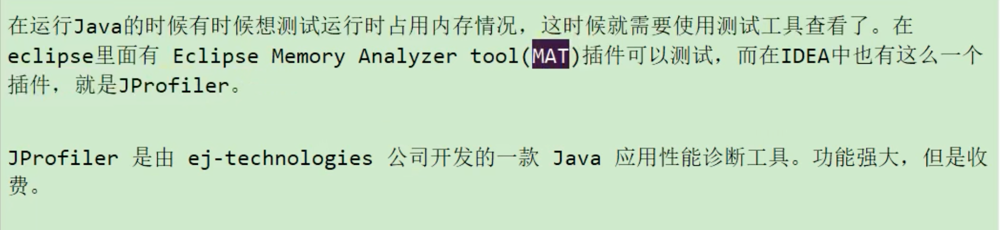

#### 4.Arthas

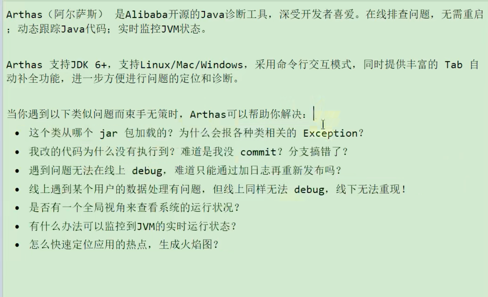
