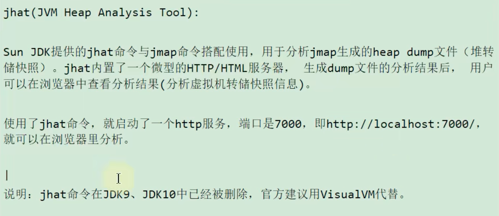

### 1.命令

#### 1.jps(Java Process Status)

#### 2.jstat(JVM Statistics Monitoring Tool) 

#### 3.jinfo(Configuration Info for Java)

#### 4.jmap(Java Memory Map)

#### 5.jhat(JVM Heap Analysis Tool)

#### 6.jstack(JVM Stack Trace)

#### 7.jcmd(多功能命令行)

### 2.图形化工具

#### 1.jconsole

#### 2.Visual VM

#### 3.JProfiler

#### 4.Arthas

