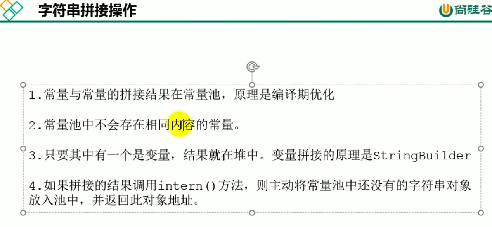
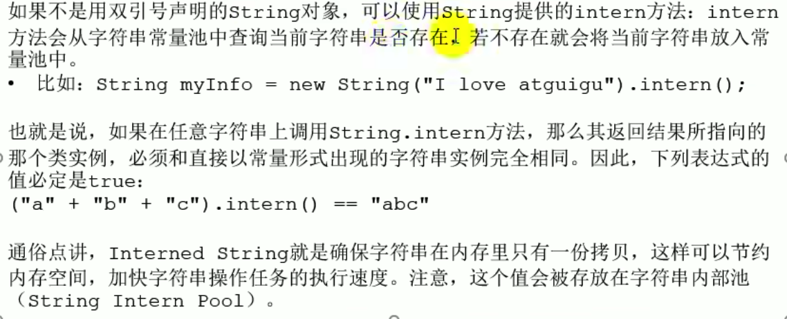
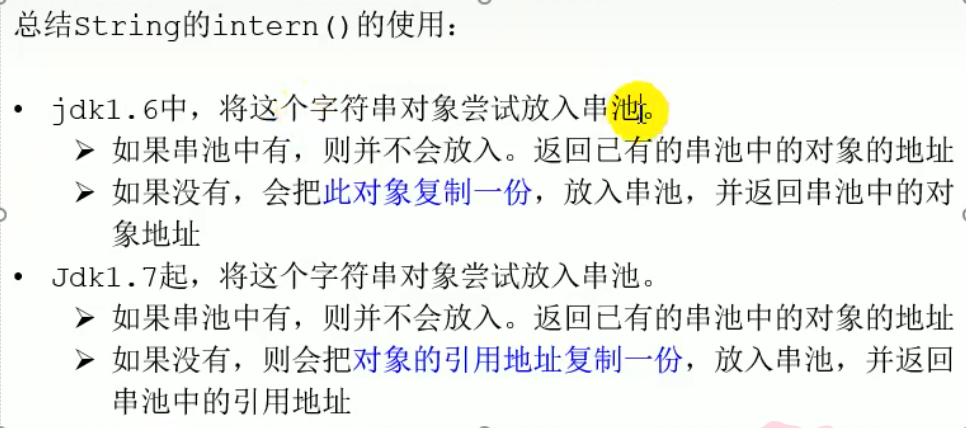
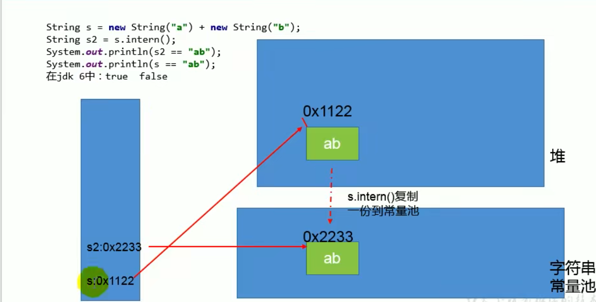
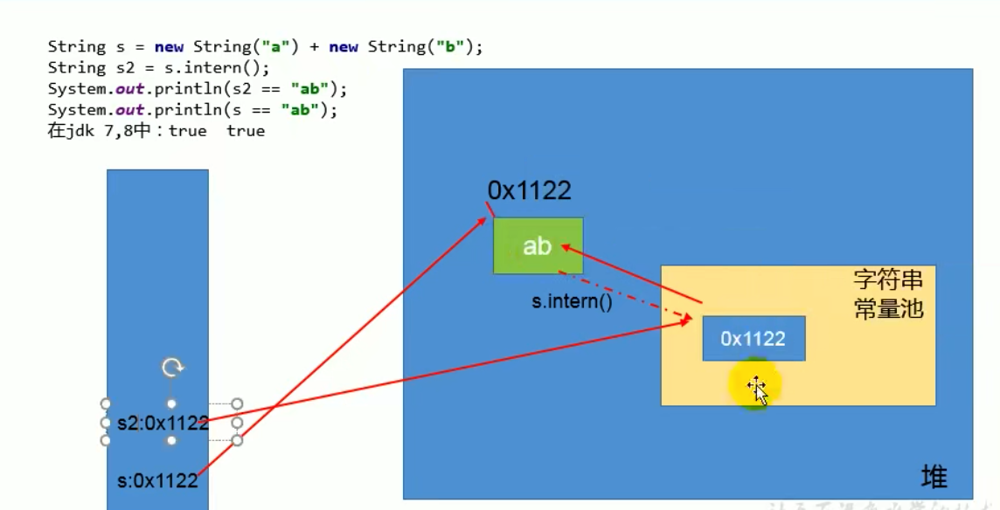
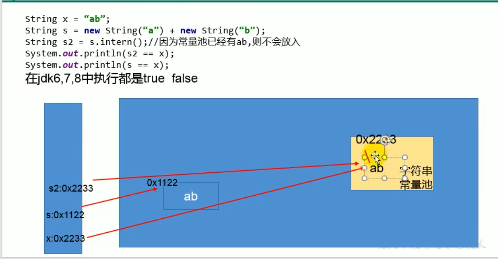

### intern()






```java
package com.example.smallwhite.jvm.chapter13;

/**
 * @author shkstart  shkstart@126.com
 * @create 2020  20:17
 */
public class StringExer1 {
    public static void main(String[] args) {
        //String x = "ab";
        String s = new String("a") + new String("b");//new String("ab")
        //在上一行代码执行完以后，字符串常量池中并没有"ab"

        String s2 = s.intern();//jdk6中：在串池中创建一个字符串"ab"
                               //jdk8中：串池中没有创建字符串"ab",而是创建一个引用，指向new String("ab")，将此引用返回

        System.out.println(s2 == "ab");//jdk6:true  jdk8:true
        System.out.println(s == "ab");//jdk6:false  jdk8:true
    }
}

```

JDK6



JDK8






### StringTable的垃圾回收

