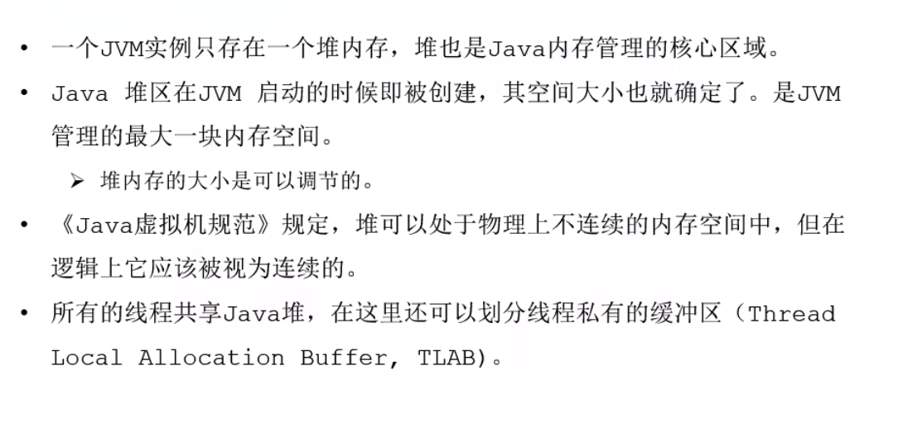

### 堆的核心概述

#### 内存细分

#### 年轻代与老年代

### 对象分配过程

#### GC

（1）Minor GC / Young GC

“新生代” 也可以称之为 “年轻代” ，这两个名词是等价的。在年轻代中的Eden内存区域被占满之后实际上就需要出发年轻代的GC，或者是新生代的GC。

此时这个新生代GC，就是所谓的 “Minor GC”，也可以称之为“Young GC”，这两个名词，都是针对新生代的GC。

（2）Full GC / Old GC

之前分析过，老年代一旦被占满之后，就会触发老年代的GC，之前称呼这种GC为Full GC。

所谓老年代的GC，称之为 “Old GC” 更加合适，因为从字面意义上就可以理解，这就是所谓的老年代GC。

但是这里把老年代GC称之为Full GC，也是可以的，只不过是一个字面意思的多种不同的说法。

（3）Full GC

针对Full GC，有个更加合适的说法，就是说Full GC指的是针对新生代、 老年代、永久代的全体内存空间的垃圾回收，所以称之为Full GC。

从字面意思理解， “Full” 就是整体的以上，所以就是对JVM进行一次整体的垃圾回收，把各个内存区域的垃圾都回收掉。

但部分人群，习惯将Full GC直接等价为 Old GC，也就是仅仅针对老年代的垃圾回收。

（4）Major GC

Major GC，一般用的比较少，也是容易混淆的概念。

有些人把Major GC跟Old GC等价起来，认为它就是针对老年代的GC，也有人把Major GC和Full GC等价起来，认为它是针对JVM全体内存区域的GC。

（5）Mixed GC

Mixed GC是G1中特有的概念，说白了，就是说在G1中，一旦老年代占据堆内存的45%了，就要出发Mixed GC，此时对年轻代和老年代都会进行回收。

#### Minor GC / Young GC

#### （2）Major GC/ Old GC

#### Full GC

