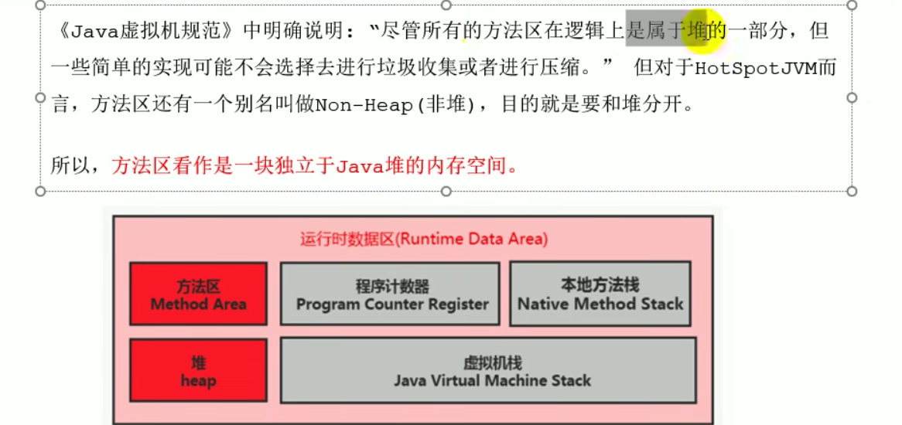


**堆栈方法区的交互关系**

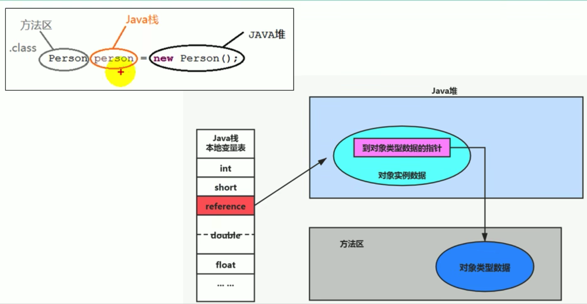


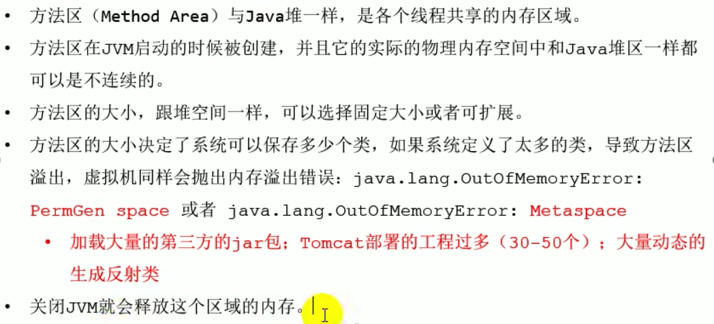

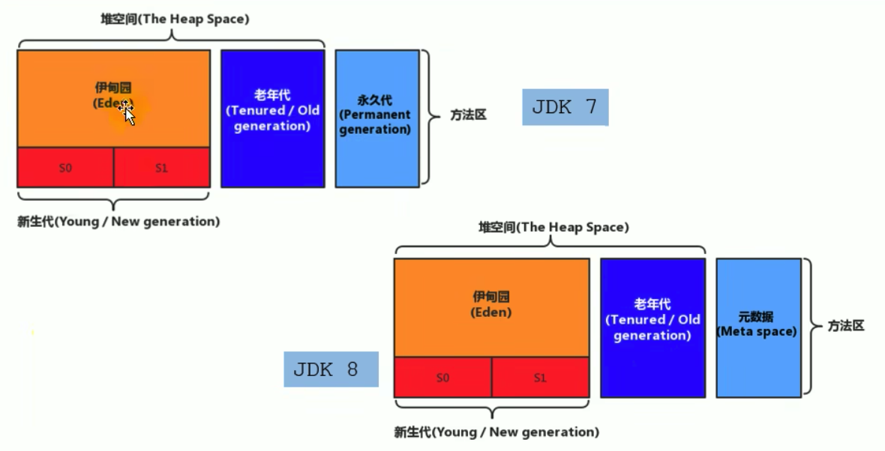


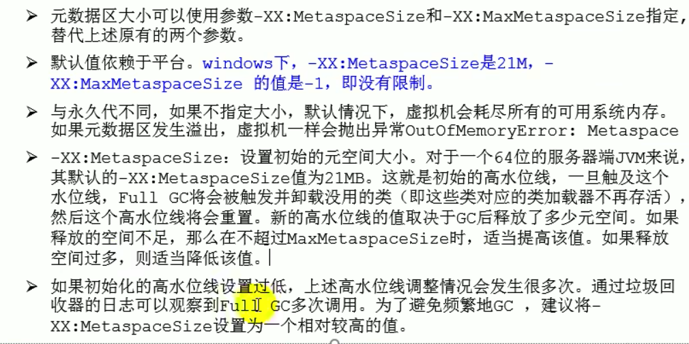


### 方法区元空间(Metaspace)OOM

```java
package com.example.smallwhite.jvm.chapter08;

import net.sf.cglib.proxy.Enhancer;
import net.sf.cglib.proxy.MethodInterceptor;
import net.sf.cglib.proxy.MethodProxy;

import java.lang.reflect.Method;

/**
 * -XX:MaxMetaspaceSize
 * */
public class JavaMethodAreaOOM {
    public static void main(String[] args) {
        while (true){
            Enhancer enhancer = new Enhancer();
            enhancer.setSuperclass(OOMObject.class);
            enhancer.setUseCache(false);
            enhancer.setCallback(new MethodInterceptor() {
                @Override
                public Object intercept(Object o, Method method, Object[] objects, MethodProxy methodProxy) throws Throwable {
                    return methodProxy.invokeSuper(o,args);
                }
            });
            enhancer.create();
        }
    }
    static class OOMObject{

    }
}
```

```
Exception in thread "main" net.sf.cglib.core.CodeGenerationException: java.lang.reflect.InvocationTargetException-->null
	at net.sf.cglib.core.AbstractClassGenerator.create(AbstractClassGenerator.java:237)
	at net.sf.cglib.proxy.Enhancer.createHelper(Enhancer.java:377)
	at net.sf.cglib.proxy.Enhancer.create(Enhancer.java:285)
	at com.example.smallwhite.jvm.chapter08.JavaMethodAreaOOM.main(JavaMethodAreaOOM.java:24)
Caused by: java.lang.reflect.InvocationTargetException
	at sun.reflect.GeneratedMethodAccessor1.invoke(Unknown Source)
	at sun.reflect.DelegatingMethodAccessorImpl.invoke(DelegatingMethodAccessorImpl.java:43)
	at java.lang.reflect.Method.invoke(Method.java:498)
	at net.sf.cglib.core.ReflectUtils.defineClass(ReflectUtils.java:384)
	at net.sf.cglib.core.AbstractClassGenerator.create(AbstractClassGenerator.java:219)
	... 3 more
Caused by: java.lang.OutOfMemoryError: Metaspace
	at java.lang.ClassLoader.defineClass1(Native Method)
	at java.lang.ClassLoader.defineClass(ClassLoader.java:756)
	... 8 more
```


方法区的内部结构


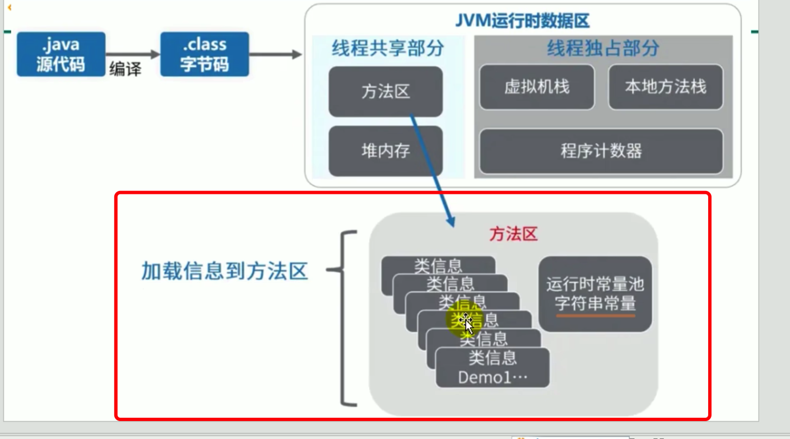


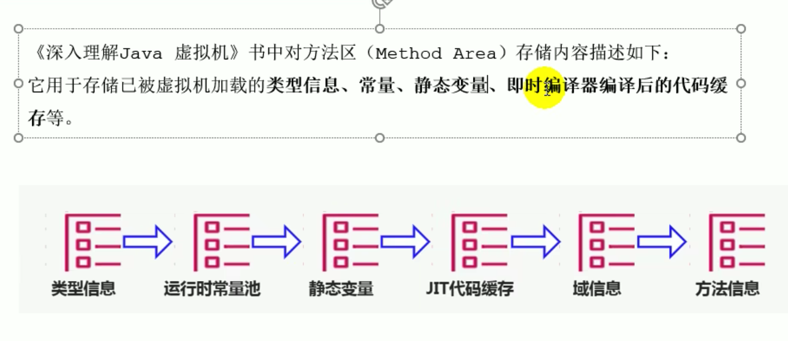


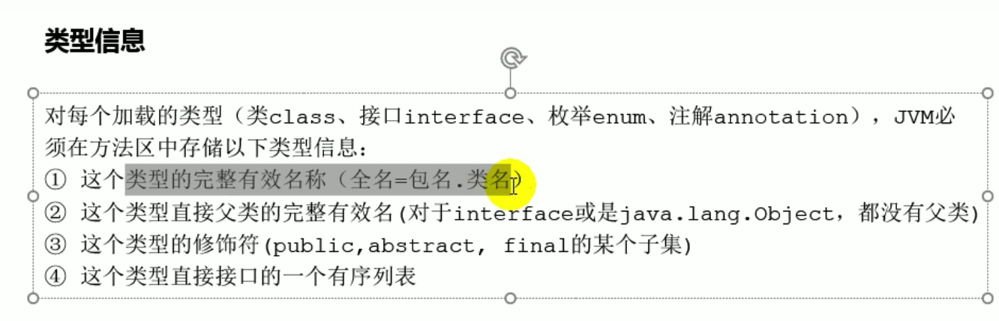


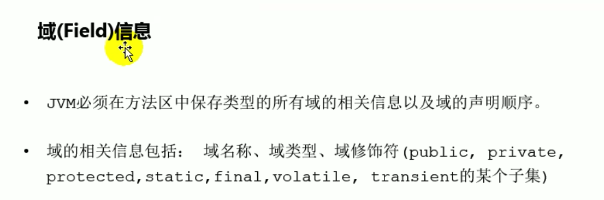


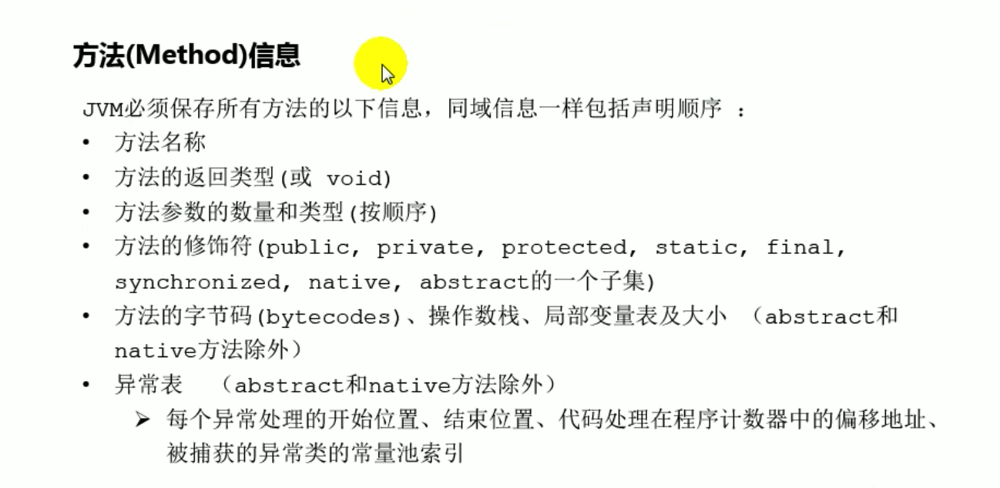

运行时常量池

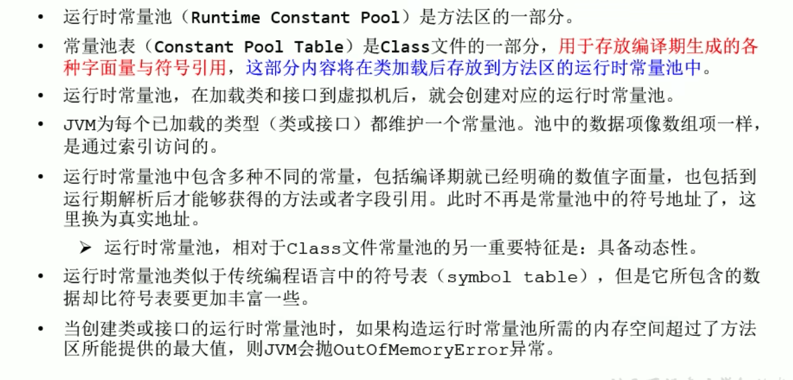


### 方法区的垃圾回收

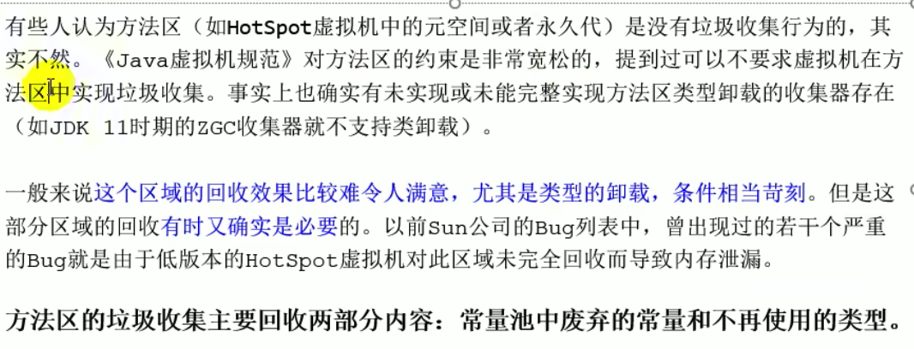

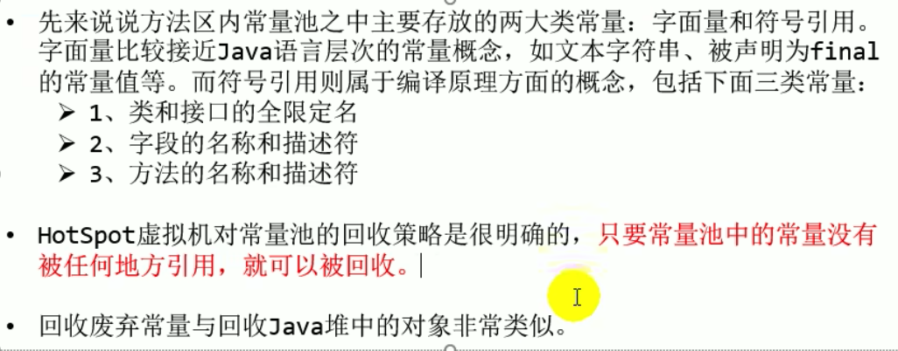

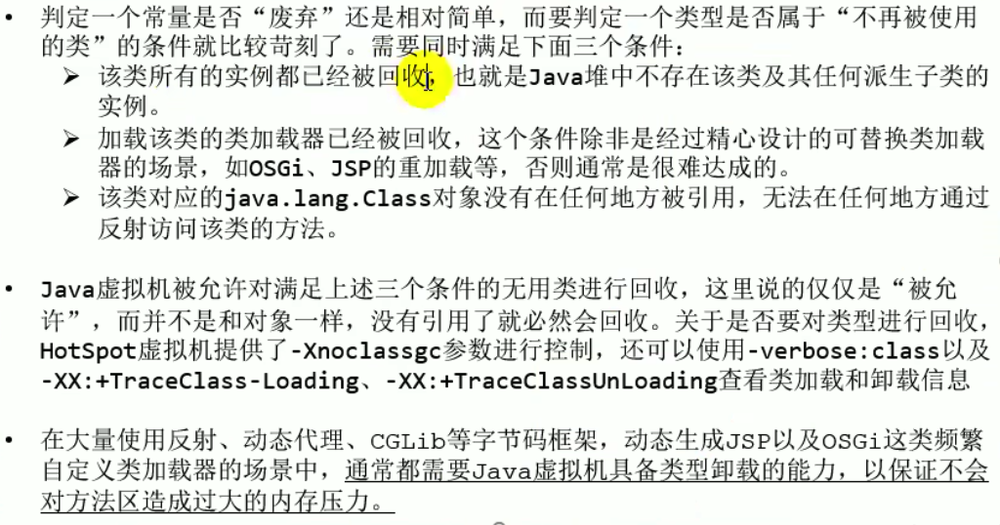