### 1.加载

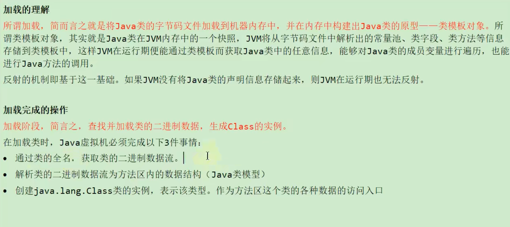

1. 通过类的全名，获取类的二进制数据流
2. 解析类的二进制数据流为方法区内的数据结构(Java类模型)
3. 创建java.lang.Class类的实例，表示该类型。作为方法区这个类的各种数据的访问入口。

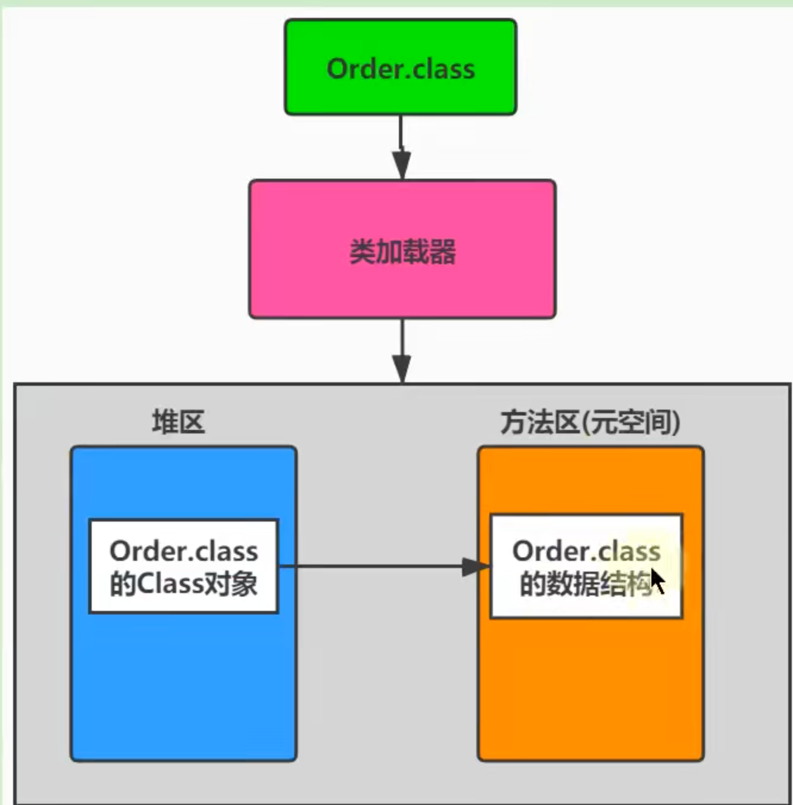

### 2.链接

#### 1.验证

保证加载的字节码文件是合法，合理合规的。

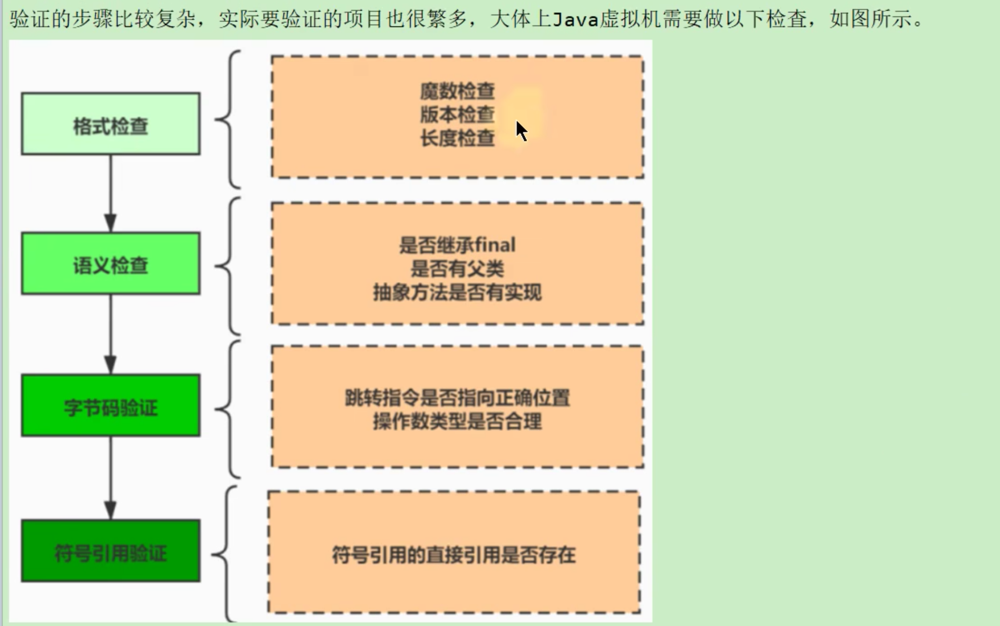

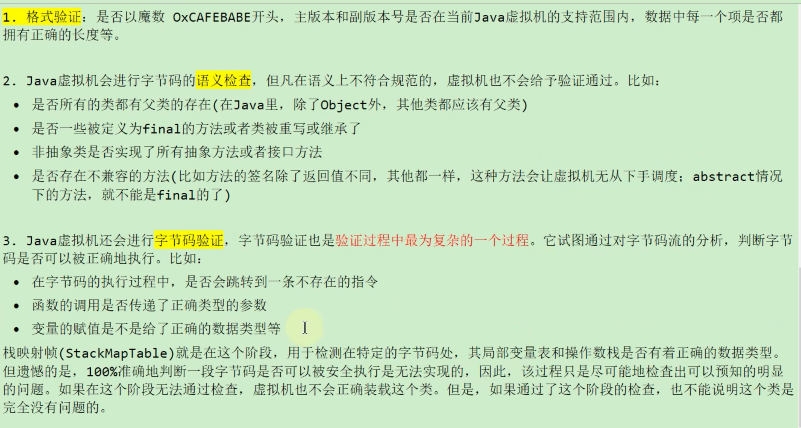

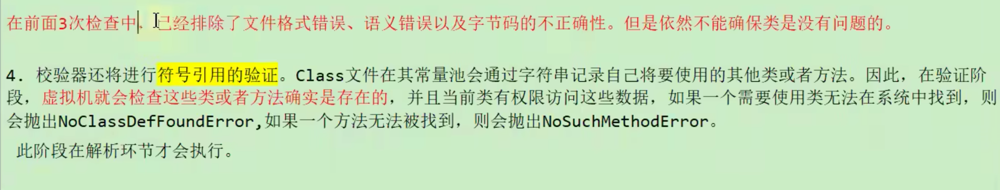

#### 2.准备

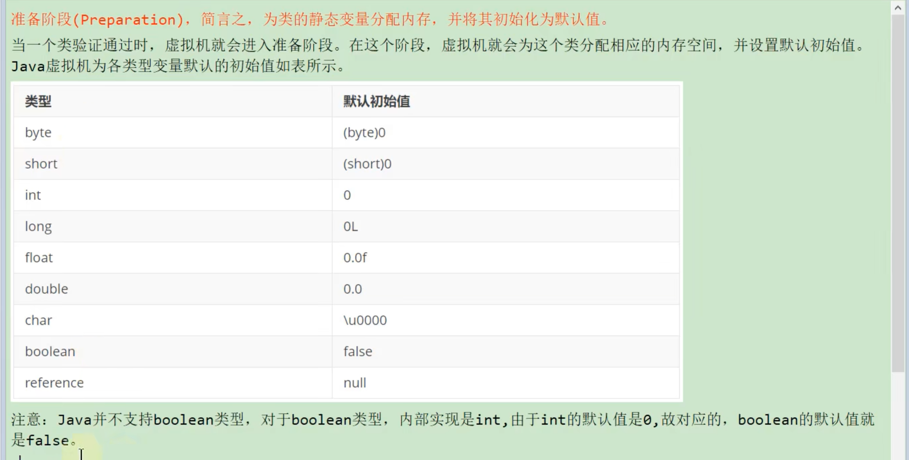

#### 3.解析

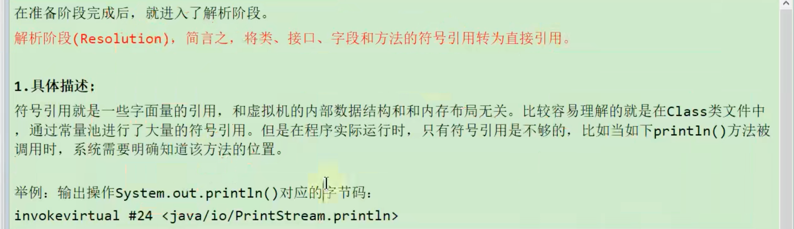

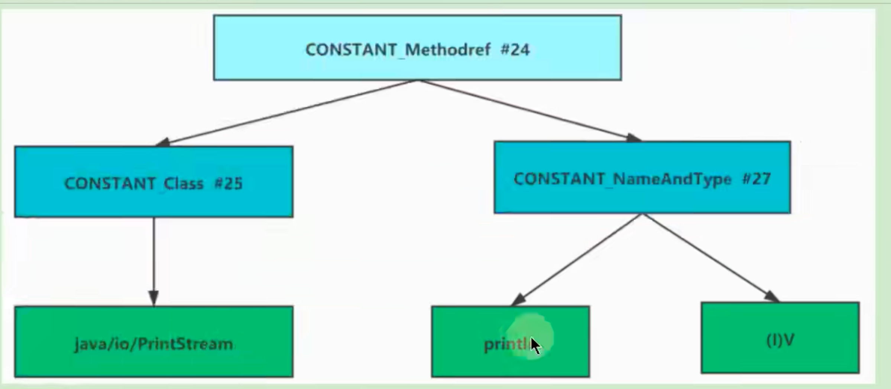

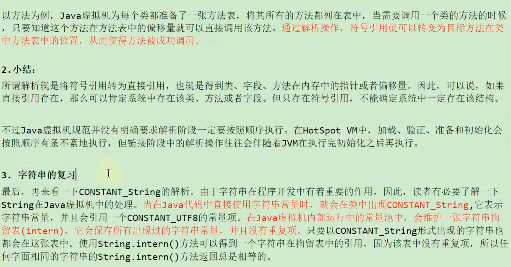

### 3.初始化

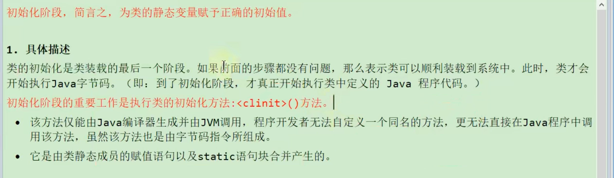

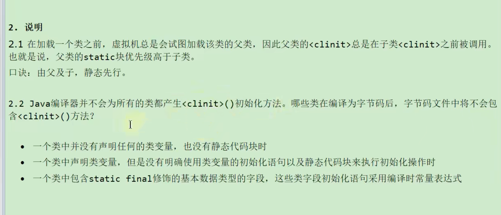

#### clinit线程安全性问题

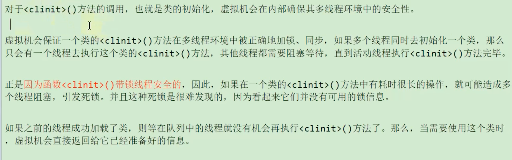

#### 类的主动使用

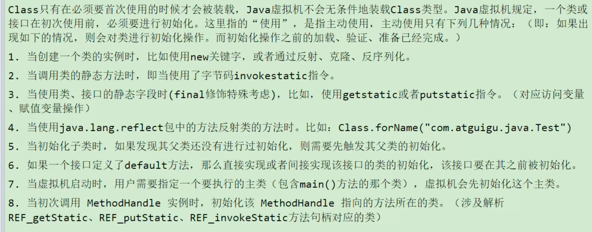

#### 类的被动使用

