- Java虚拟机栈是什么？

Java虚拟机栈(Java Virtual Machine Stack) 早期也叫java栈。每个线程在创建时都会去创建一个虚拟机栈，其内部保存一个个的栈帧(Stack Frame)，对应着一次次的Java方法调用。Java虚拟机栈是每个线程私有的

- Java虚拟机栈的生命周期

生命周期和线程一致

- 作用

主管Java程序的运行，他保存方法的局部变量(8种基本数据类型、对象的引用地址)、部分结果，并参与方法的调用和返回


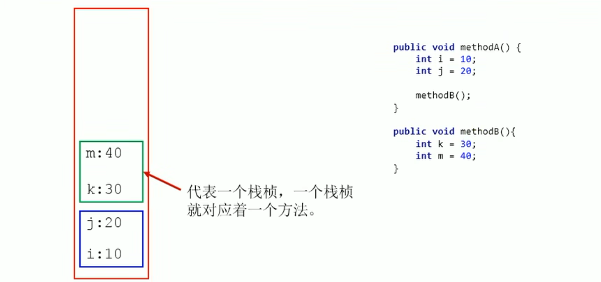

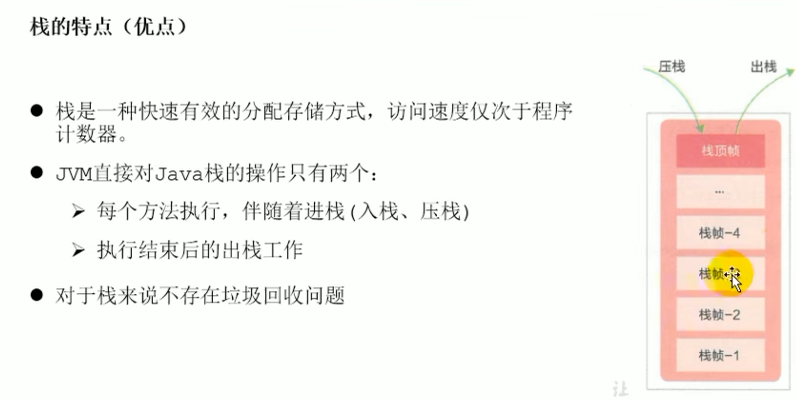


### 局部变量表(Local Viarables)

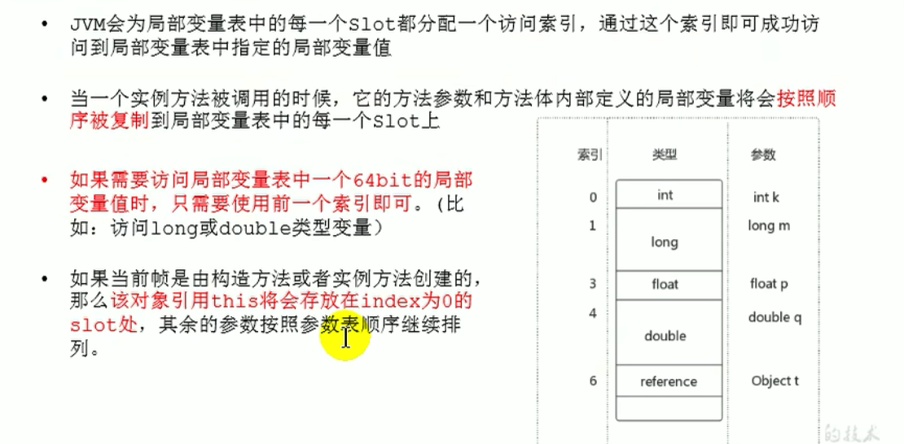

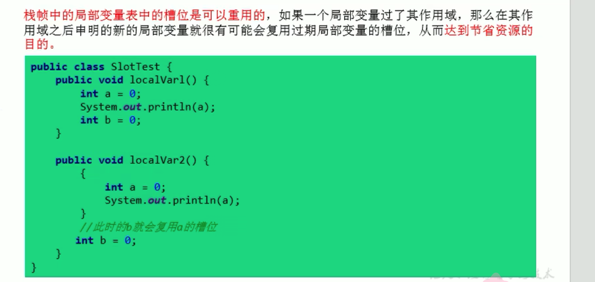

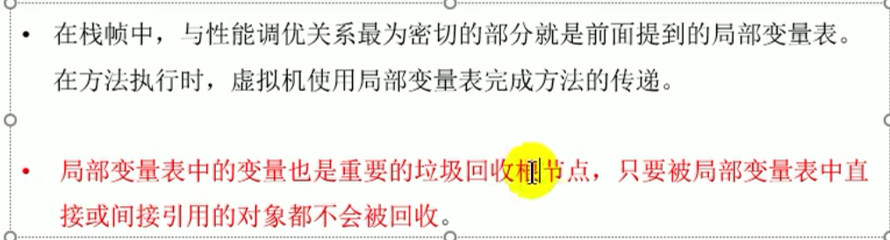


### 操作数栈(Operand Stack)

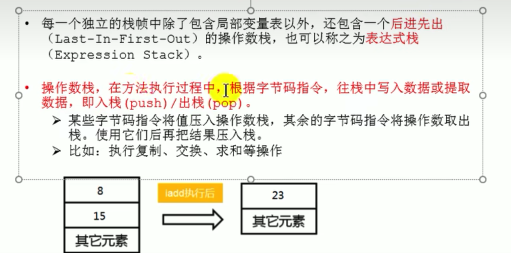

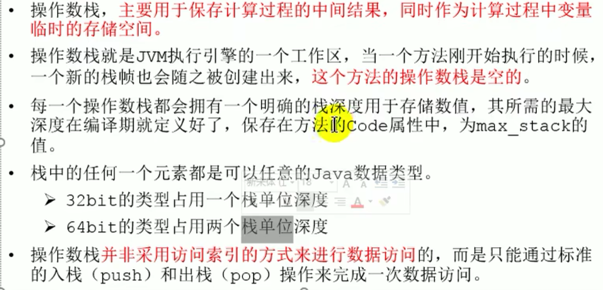

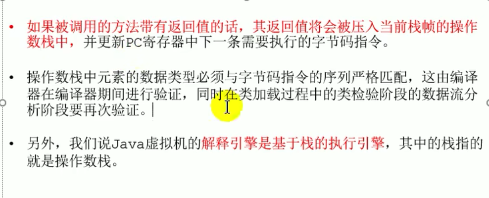

分析一下操作数栈的执行过程

```java
package com.example.smallwhite.jvm.chapter05;

public class OperandStackTest {
    public void testOperandStack(){
       byte i =15;
       int j =8;
       int k = i + j;
    }
}
```

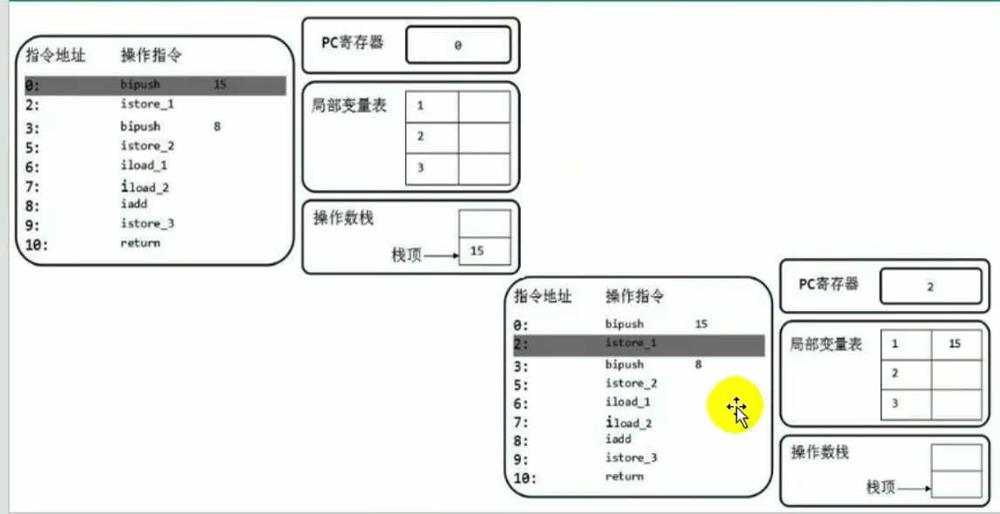

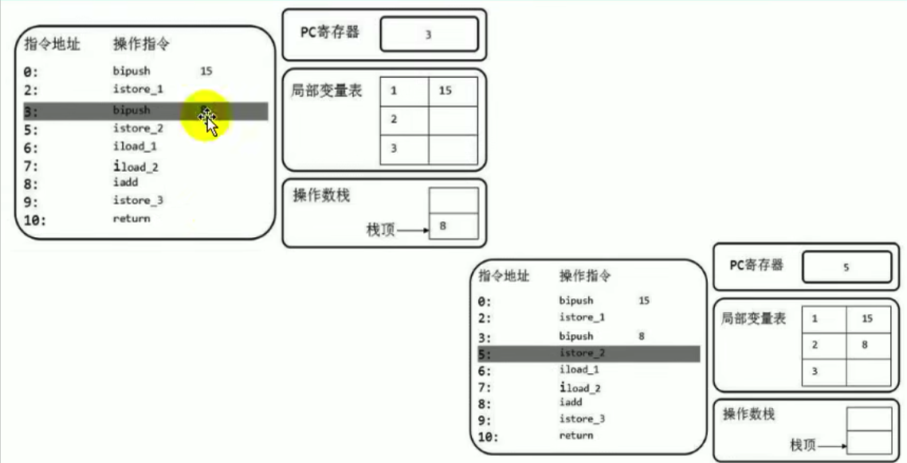

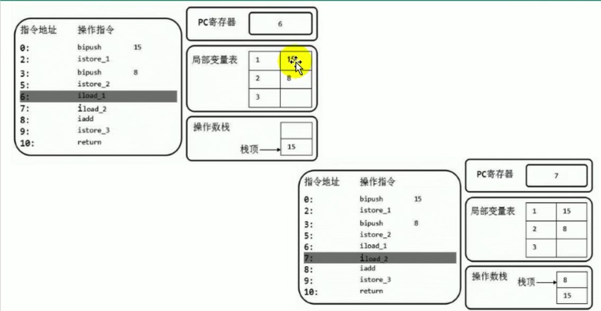

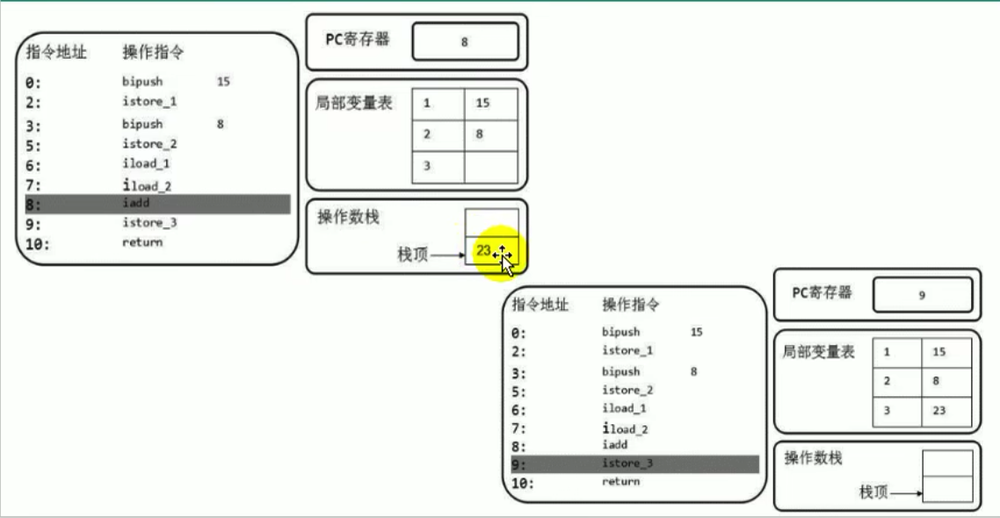

**在字节码层面分析一下i++ 和 ++i**


### 动态链接(Dynamic Linking) (指向运行时常量池的方法引用)

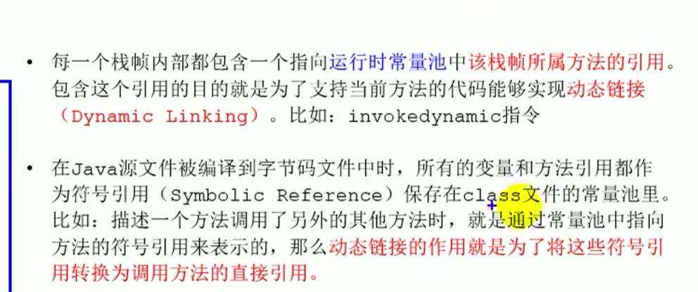


**方法的调用**

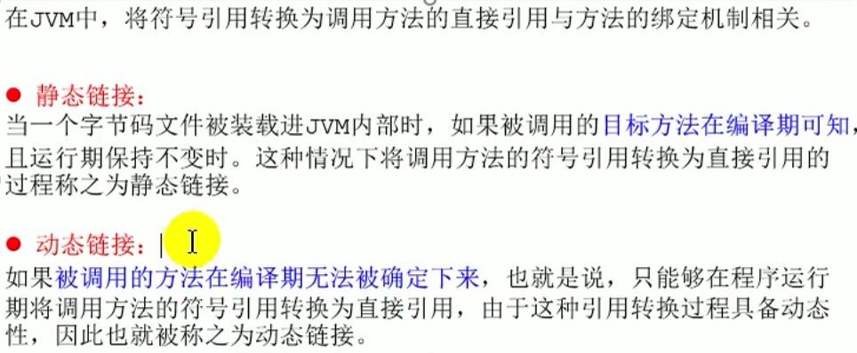

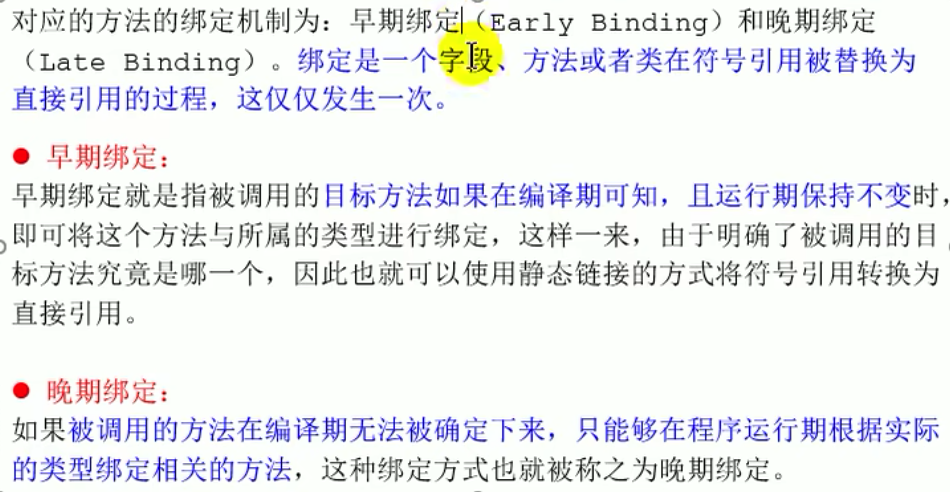

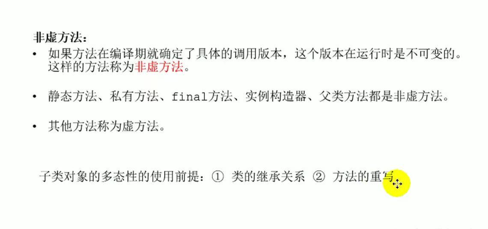

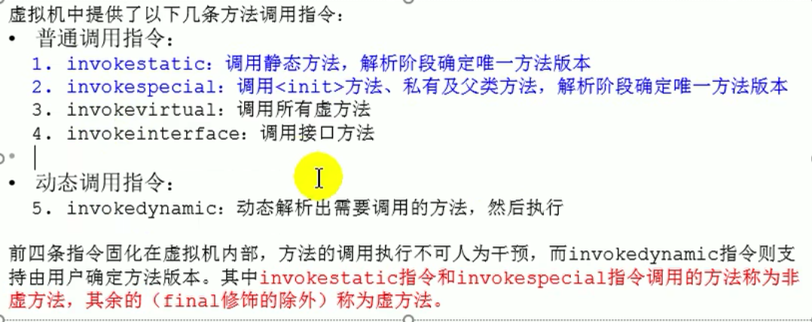

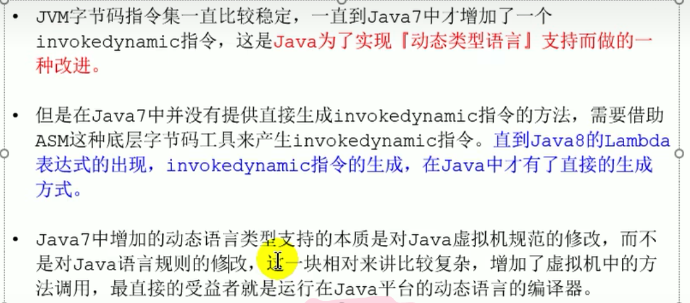


### 方法返回地址(Return Address)


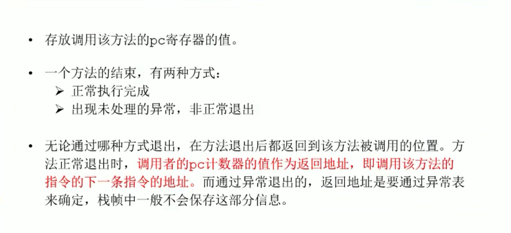

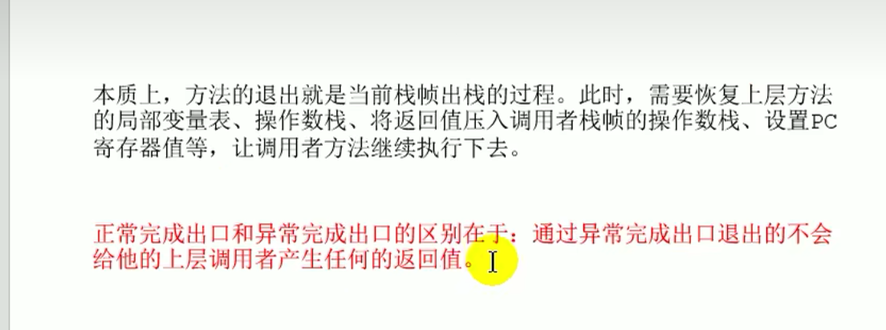

