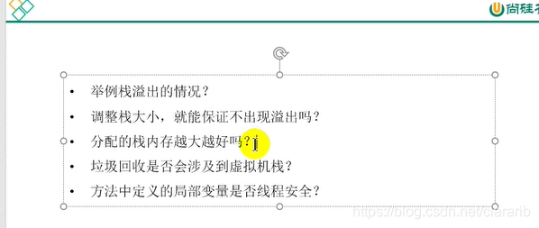

### 1.举例栈溢出的情况

- 如果线程请求的栈深度大于虚拟机所允许的最大深度，将抛出StackOverflowError异常
- 如果虚拟机在扩展栈时无法申请到足够的内存空间，则抛出OutOfMemoryError异常。

在单个线程下，无论是由于栈帧太大还是虚拟机栈容量太小，当内存无法分配的时候，虚拟机抛出的都是StackOverflowError异常。
在多线程下，通过不断建立线程的方式可以产生内存溢出异常。但是这样产生的内存溢出异常与栈空间是否足够大并不存在任何联系，或者准确的说，在这种情况下，为每个线程的栈分配的内存越大，反而越容易产生栈溢出异常。因为操作系统分配给每个进程的内存时有限制的，所以（操作系统限制的内存）-（java堆的最大容量）-（方法区最大容量）=（虚拟机栈容量）+（本地方法栈容量）。所以每个线程分配到的栈容量越大，可以建立的线程数量就越少，建立线程时就越容易把剩下的内存耗尽。

第一题：
栈溢出（StackOverflowError:）
当栈的大小不够的时候，可以通过-Xss设置栈的大小，如果整个空间都不足了，就会出OOM的错误

第二题：
不能，只能够说出现StackOverflowError的时间会晚一些，但是不能保证一定不会溢出

第三题：
不是！只是会出错的时间会晚一些，会占用资源

第四题：不会！

总结:
对于
                     error   GC(垃圾回收)
程序计数器 不涉及 不涉及
本地方法栈 涉及     不涉及
虚拟机栈     涉及     不涉及
堆                 涉及     涉及
方法区         涉及     涉及

第五题：具体问题具体分析

如果变量是在内部产生，内部消亡的，那么是线程安全的；
如果变量不是在内部产生的，或者又返回了出去，就是线程不安全的