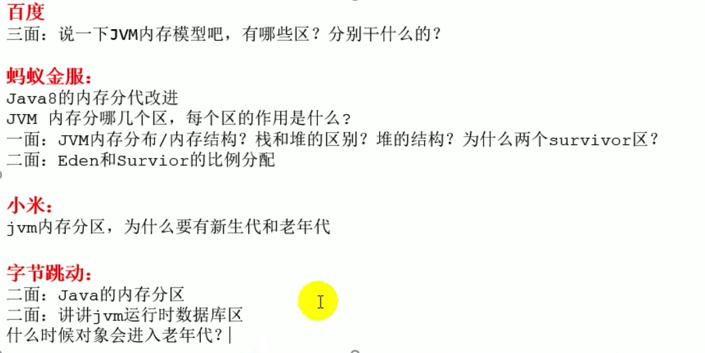

### 什么是双亲委派机制

> java虚拟机对class文件采用的是按需加载的方式，也就是说当需要使用该类时才会将它的class文件加载到内存生成class对象。而且加载某个类的calss文件时，java虚拟机采用的是双亲委派模式，即把请求交由给父类处理，他是一种任务委派模式 

#### 工作原理

1. 如果一个类加载器收到了类加载请求，它并不会自己先去加载，而是把这个请求委托给最上层的父类加载器去执行 最终到达启动类加载器进行执行
2. 如果父类加载器可以完成类加载的任务。就成功返回，倘若夫类加载器无法完成此加载任务，子加载器才会尝试自己去加载。这就是双亲委派模式

#### 双亲委派机制优势

- 避免类的重复加载
- 保护程序安全，避免java核心API被篡改，比如自定义 java.lang.String 此时会加载核心类String 执行main方法的时候报错没有main方法。或者自定义一个java.lang.myTest 会报错 Prohibited package name: java 不可以使用这个包名
- 实现一些SPI接口的时候由 引导类加载器加载 核心jar包。具体实现类为第三方jar包由系统类加载加载

#### 沙箱安全机制

> 对于自定义的java.lang.String 类，加载的时候会使用引导类加载器进行加载， 运行main方法的时候会报错没有main方法。因为加载的是rt.jat包中的String类。这样可以保证对java核心源代码的保护。这个就叫沙箱安全机制


### 使用PC寄存器存储字节码指令地址有什么用呢。为什么使用PC寄存器记录当前线程的执行地址呢

- CPU需要不停的在多个线程之间切换，切换完成后需要知道接着应该从哪里开始继续执行。
- JVM的字节码解释器就需要通过改变PC寄存器的值来明确下一条应该执行什么样的字节码指令 

### PC寄存器为什么会被设定为线程私有


### 4.虚拟机栈会出现什么异常

### 1.StackOverFlowError

```java
package com.example.smallwhite.jvm.chapter05;

public class StackOverFlowTest {
    private static int count = 0;
    public static void main(String[] args) {
        System.out.println(++count);
        main(args);
    }
}
```

> 递归调用出现死循环的时候并且采用的是固定的虚拟机栈内存   会报StackOverFlowError
>
> 如果采用的是动态扩展的虚拟机内存的话 则会报错 OutOfMemoryError


=======


### 常用的jvm命令

```js
设置栈空间大小
-Xss1m
-Xss1024k
-Xss1048576

设置堆空间大小
-Xms10m 设置堆区的起始内存
-Xmx10m 设置堆区的最大内存
-Xmn100m 设置新生代的大小
打印GC过程中的细节
-XX:+PrintGCDetails

-XX:NewRatio=2 表示新生代占1 老年代占2  新生代占整个堆的 1/3
-XX:SurvivorRatio=8 表示新生代Eden:surv0:surv1 =8:1:1 但是堆有自适应机制可能不是这个比例
-XX:-UseAdaptiveSizePolicy   -关闭自适应内存分配策略 +打开自适应内存分配策略

-XX:MaxTenuringThreshold=<N> 进行设置 从幸存者区->老年代转换的阈值
-XX:-DoEscapeAnalysis  -关闭逃逸分析 +打开逃逸分析
-XX:-EliminateAllocations -关闭标量分析 +打开标量分析

jdk1.7
-XX:PermSize 来设置永久代初始分配空间.默认值是20.75m
-XX:MaxPermSize 来设置永久代最大可分配空间。32位机器默认是64m 64位机器默认是82m
jdk1.8
-XX:MetaspaceSize 来设置元空间初始分配空间.默认值是21m
-XX:MaxMetaspaceSize 来设置元空间最大分配空间.默认值是-1 即没有上限

-XX:StringTableSize 来设置字符串常量池的初始size


-XX:+PrintCommandLineFlags
-XX:+UseSerialGC:表明新生代使用Serial GC ，同时老年代使用Serial Old GC
-XX:+UseParNewGC：标明新生代使用ParNew GC
-XX:+UseParallelGC:表明新生代使用Parallel GC
-XX:+UseParallelOldGC : 表明老年代使用 Parallel Old GC
说明：二者可以相互激活
-XX:+UseConcMarkSweepGC：表明老年代使用CMS GC。同时，年轻代会触发对ParNew 的使用
```


### 什么是逃逸分析

**为什么“逃逸”？**

　　在计算机语言编译器优化原理中，逃逸分析是指分析指针动态范围的方法，它同编译器优化原理的指针分析和外形分析相关联。当变量（或者对象）在方法中分配后，其指针有可能被返回或者被全局引用，这样就会被其他方法或者线程所引用，这种现象称作指针（或者引用）的逃逸(Escape)。通俗点讲，如果一个对象的指针被多个方法或者线程引用时，那么我们就称这个对象的指针（或对象）的逃逸（Escape）。

**什么是逃逸分析？**

逃逸分析，是一种可以有效减少Java 程序中同步负载和内存堆分配压力的跨函数全局数据流分析算法。通过逃逸分析，Java Hotspot编译器能够分析出一个新的对象的引用的使用范围从而决定是否要将这个对象分配到堆上。 逃逸分析（Escape Analysis）算是目前Java虚拟机中比较前沿的优化技术了。

**逃逸分析的原理？**

　　Java本身的限制（对象只能分配到堆中），我可以这么理解了，为了减少临时对象在堆内分配的数量，我会在一个方法体内定义一个局部变量，并且该变量在方法执行过程中未发生逃逸，按照JVM调优机制，首先会在堆内存创建类的实例，然后将此对象的引用压入调用栈，继续执行，这是JVM优化前的方式。然后，我采用逃逸分析对JVM进行优化。即针对栈的重新分配方式，首先找出未逃逸的变量，将该变量直接存到栈里，无需进入堆，分配完成后，继续调用栈内执行，最后线程执行结束，栈空间被回收，局部变量也被回收了。如此操作，是优化前在堆中，优化后在栈中，从而减少了堆中对象的分配和销毁，从而优化性能。

**逃逸的方式？**

　　方法逃逸：在一个方法体内，定义一个局部变量，而它可能被外部方法引用，比如作为调用参数传递给方法，或作为对象直接返回。或者，可以理解成对象跳出了方法。

　　线程逃逸：这个对象被其他线程访问到，比如赋值给了实例变量，并被其他线程访问到了。对象逃出了当前线程。

**逃逸分析的好处？**

　　如果一个对象不会在方法体内，或线程内发生逃逸（或者说是通过逃逸分析后，使其未能发生逃逸）

　　1. 栈上分配：

一般情况下，不会逃逸的对象所占空间比较大，如果能使用栈上的空间，那么大量的对象将随方法的结束而销毁，减轻了GC压力

　　2. 同步消除：

　　如果你定义的类的方法上有同步锁，但在运行时，却只有一个线程在访问，此时逃逸分析后的机器码，会去掉同步锁运行。

　　3. 标量替换

　　Java虚拟机中的原始数据类型（int，long等数值类型以及reference类型等）都不能再进一步分解，它们可以称为标量。相对的，如果一个数据可以继续分解，那它称为聚合量，Java中最典型的聚合量是对象。如果逃逸分析证明一个对象不会被外部访问，并且这个对象是可分解的，那程序真正执行的时候将可能不创建这个对象，而改为直接创建它的若干个被这个方法使用到的成员变量来代替。拆散后的变量便可以被单独分析与优化，可以各自分别在栈帧或寄存器上分配空间，原本的对象就无需整体分配空间了。


### 怎么解决OOM


### 方法区的演进细节 为什么要用元空间替代永久代


### 一些题目




### Java 9 为何要将String的底层实现由char[]改成了byte[]?

https://cloud.tencent.com/developer/article/1984858


### new String("ab"),new String("a")+new String("b")会创建几个对象

```java
package com.atguigu.java2;

/**
 * 题目：
 * new String("ab")会创建几个对象？看字节码，就知道是两个。
 *     一个对象是：new关键字在堆空间创建的
 *     另一个对象是：字符串常量池中的对象"ab"。 字节码指令：ldc
 *
 *
 * 思考：
 * new String("a") + new String("b")呢？
 *  对象1：new StringBuilder()
 *  对象2： new String("a")
 *  对象3： 常量池中的"a"
 *  对象4： new String("b")
 *  对象5： 常量池中的"b"
 *
 *  深入剖析： StringBuilder的toString():
 *      对象6 ：new String("ab")
 *       强调一下，toString()的调用，在字符串常量池中，没有生成"ab"
 *
 * @author shkstart  shkstart@126.com
 * @create 2020  20:38
 */
public class StringNewTest {
    public static void main(String[] args) {
//        String str = new String("ab");

        String str = new String("a") + new String("b");
    }
}

```

