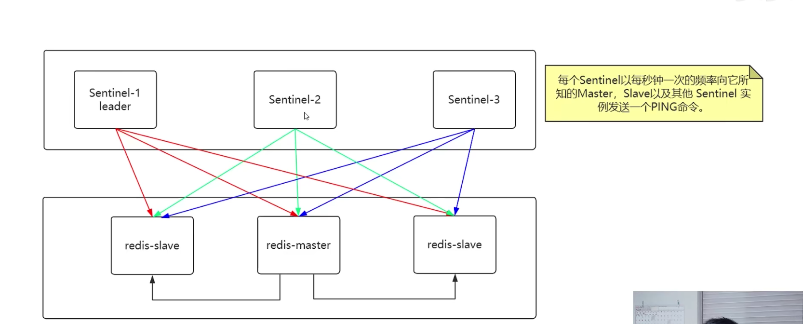
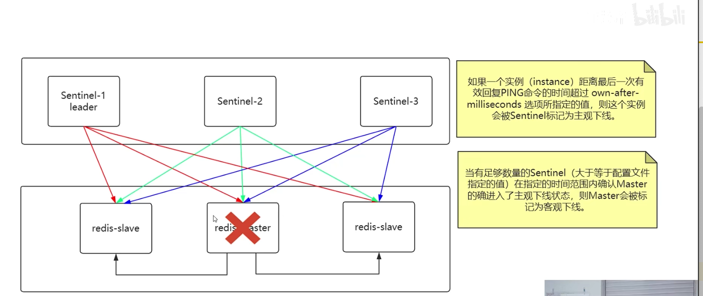
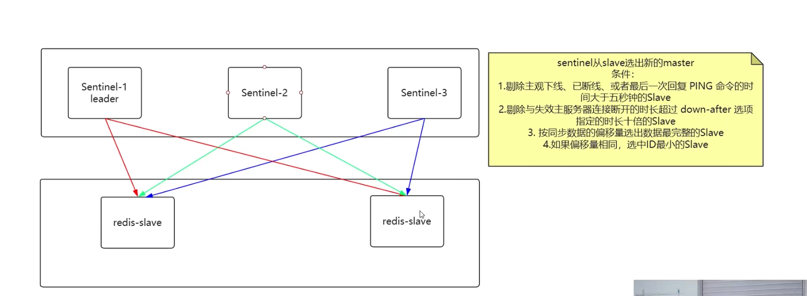
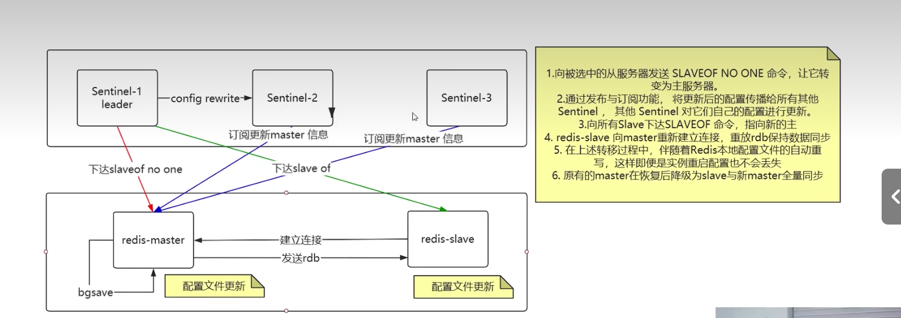
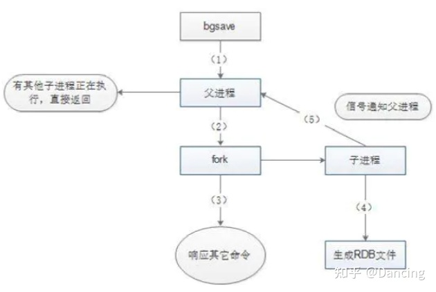
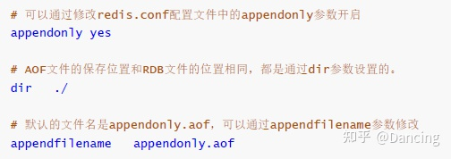
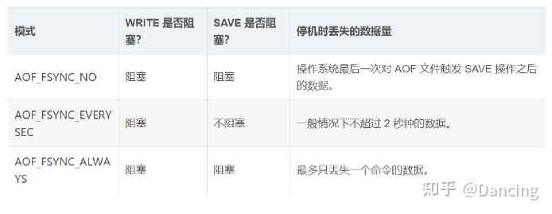

### 哨兵模式

### Redis的持久化

#### 1.RDB

RDB（Redis DataBase），是redis默认的存储方式，RDB方式是通过快照（ snapshotting ）完成的。它保存的是某一时刻的数据并不关注过程。**RDB保存redis某一时刻的数据的快照**

> **触发快照的方式**
>
> 1. 符合自定义配置的快照规则；
> 2. 执行save或者bgsave命令；
> 3. 执行flushall命令；
> 4. 执行主从复制操作 (第一次)

> **配置参数定期执行**
> 在redis.conf中配置：save 多少秒内数据变了多少，可以配置多个条件，漏斗设计满足其中一个条件就会触发生成快照， 提搞性能

**RDB执行流程（原理）**

1. Redis父进程首先判断：当前是否在执行save，或bgsave/bgrewriteaof（aof文件重写命令）的子进程，如果在执行则bgsave命令直接返回；

2. 父进程执行fork（调用OS函数复制主进程）操作创建子进程，这个过程中父进程是阻塞的，Redis不能执行来自客户端的任何命令；

3. 父进程fork后，bgsave命令返回”Background saving started”信息并不再阻塞父进程，并可以响应其他命令；

4. 子进程创建RDB文件，根据父进程内存快照生成临时快照文件，完成后对原有文件进行原子替换（RDB始终完整）；

5. 子进程发送信号给父进程表示完成，父进程更新统计信息。

6. 父进程fork子进程后，继续工作。

  **优点**

- 适合大规模数据恢复，速度比 AOF 恢复快。
- 生成的 RDB 文件很小，占用空间小，因为文件是二进制压缩的格式。
- 对 Redis 的读写性能影响较小。

**缺点**

- RDB 采用定时持久化，存在数据的丢失可能，如果 Redis 在最近一次持久化之后宕机了，那么这段时间的数据就无法恢复了。
- 因为 RDB 是一种全量备份，而非增量备份，所以在数据量较大时，保存 RDB 文件所需的时间也会相应增加。
- 对于频繁修改的数据，RDB 的持久化效果较差。

#### 2.AOF

AOF（append only file）是Redis的另一种持久化方式。**Redis默认情况下是不开启的**。开启AOF持久化后Redis 将所有对数据库进行过**写入的命令（及其参数）（RESP）记录到 AOF 文件**， 以此达到记录数据库状态的目的，这样当Redis重启后只要按顺序回放这些命令就会恢复到原始状态了。**AOF会记录过程，RDB只管结果**

**AOF持久化实现**

**AOF原理**
AOF文件中存储的是redis的命令，同步命令到 AOF 文件的整个过程可以分为三个阶段:

> **命令传播**：Redis 将执行完的命令、命令的参数、命令的参数个数等信息发送到 AOF 程序中;
> 当一个 Redis 客户端需要执行命令时， 它通过网络连接， 将协议文本发送给 Redis 服务器。服务器在接到客户端的请求之后， 它会根据协议文本的内容， 选择适当的命令函数， 并将各个参数从字符串文本转换为 Redis 字符串对象（ StringObject ）。每当命令函数成功执行之后， 命令参数都会被传播到AOF 程序。
>
> **缓存追加**：AOF 程序根据接收到的命令数据，将命令转换为网络通讯协议的格式，然后将协议内容追加到服务器的 AOF 缓存中。
> 当命令被传播到 AOF 程序之后， 程序会根据命令以及命令的参数， 将命令从字符串对象转换回原来的协议文本。协议文本生成之后， 它会被追加到 redis.h/redisServer 结构的 aof_buf 末尾。
> redisServer 结构维持着 Redis 服务器的状态， aof_buf 域则保存着所有等待写入到 AOF 文件的协议文本（RESP）。
>
> **文件写入和保存**：AOF 缓存中的内容被写入到 AOF 文件末尾，如果设定的 AOF 保存条件被满足的话，fsync 函数或者 fdatasync 函数会被调用，将写入的内容真正地保存到磁盘中。
> 每当服务器常规任务函数被执行、 或者事件处理器被执行时，aof.c/flushAppendOnlyFile 函数都会被调用， 这个函数执行以下两个工作：
> **WRITE**：根据条件，将 aof_buf 中的缓存写入到 AOF 文件。
> **SAVE**：根据条件，调用 fsync 或 fdatasync 函数，将 AOF 文件保存到磁盘中。因为 **SAVE 是由 Redis 主进程执行的，所以在 SAVE 执行期间，主进程会被阻塞，不能接受命令请求**。
>
> **AOF 保存模式:**
> **AOF_FSYNC_NO ：不保存。**
> 在这种模式下， 每次调用 flushAppendOnlyFile 函数， WRITE 都会被执行， 但 SAVE 会被略过。当出现Redis 被关闭、AOF 功能被关闭 、 系统的写缓存被刷新（可能是缓存已经被写满，或者定期保存操作被执行）中任意一种情况都会触发save执行，并且会Redis 主进程阻塞。
> **AOF_FSYNC_EVERYSEC ：每一秒钟保存一次。（默认）**
> 在这种模式中， SAVE 原则上每隔一秒钟就会执行一次， 因为 SAVE 操作是由后台子线程（fork）调用的， 所以它不会引起服务器主进程阻塞**。**
> **AOF_FSYNC_ALWAYS ：每执行一个命令保存一次。（不推荐）**
> 在这种模式下，每次执行完一个命令之后， WRITE 和 SAVE 都会被执行。

**优点**

- AOF 持久化方式可以最大程度保证数据不丢失，即使 Redis 宕机，也可以通过重放日志文件来恢复数据。
- 因为 AOF 是一种增量备份方式，所以可以较好的保证数据的一致性和完整性。
- AOF 文件是一个文本文件，可以方便地查看和修改。

**缺点**

- AOF 文件通常比 RDB 文件大。
- AOF 文件是文本文件，如果文件过大，可能会导致文件系统的 I/O 操作瓶颈，进而影响 Redis 性能。
- AOF 持久化方式的恢复速度相对较慢，因为需要将文件中的所有操作命令重新执行一遍。

